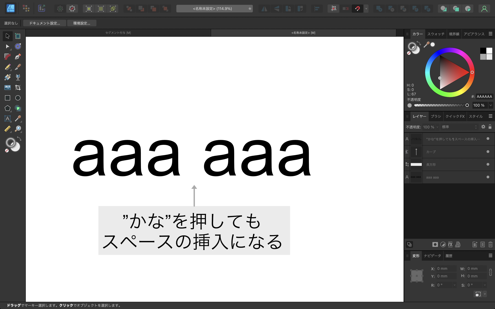
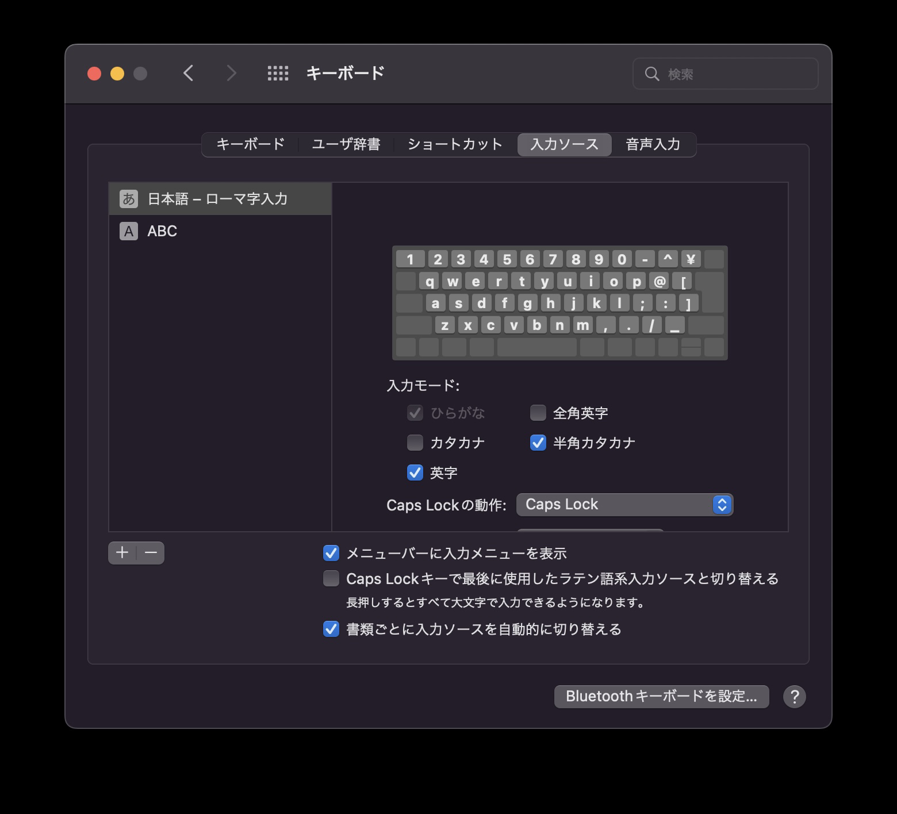
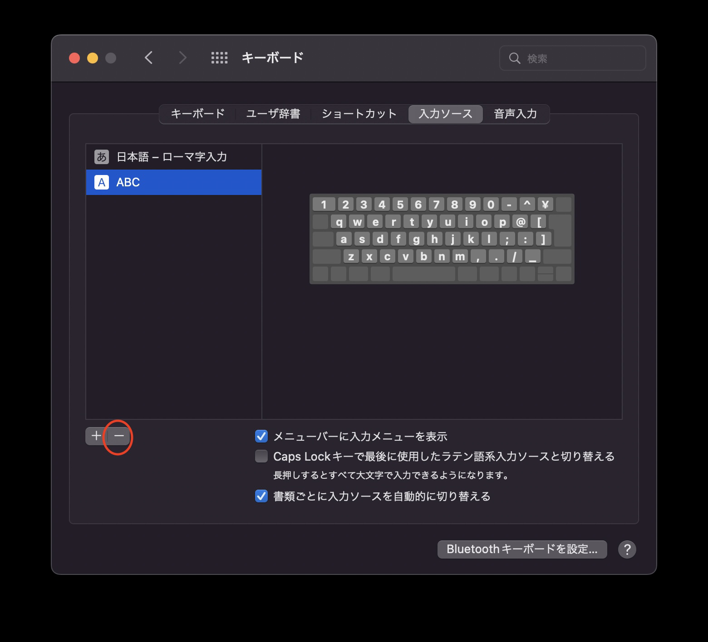

## 問題

Mac版Affinity Designerでテキストを作るとき、英数かなを押しても入力切り替えが行われず、代わりにスペースが挿入されてしまうことがある。
英数入力状態なら半角スペースが、かな入力なら全角スペース挿入される。

## 解決方法
Mac環境設定->キーボード->入力ソース

### STEP.1 "日本語 - ローマ字入力"の英字にチェックを入れる

### STEP.2 "ABC"に切り替えて下の"-"ボタンを押す

参考

[Twitter link](https://twitter.com/rriver/status/1341707225329356800)

