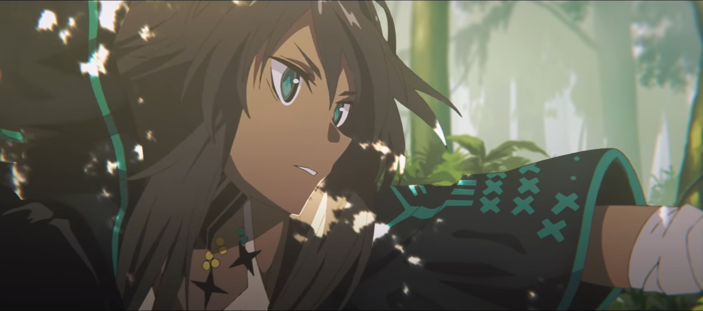

## あいさつ
アークナイツAdvent Calender6日目担当のnozzleです。
アークナイツの有益な情報をシェアできたらと思います。

でも危機契約#5で最大戦力と人海戦術を駆使して12等級がやっとのドクターに、共有できる有益な情報があるはずありません。

そこで、皆様にとっては周知の事実かも知れませんが、今一度アークナイツの包帯キャラをまとめてみたいと思います。

画像の著作権はすべて権利者に帰属します。

## 包帯キャラ一覧

**---- _まだ休んじゃダメですよ。_**  
**アーミヤ**
> アークナイツの顔にして、ロドスの最高幹部。  
> ウェイや氷川きよしを相手に臆することなく会話できる。  
  
---

**---- _オムニバスストーリー 戦地の逸話_**  
**エンカク**
> 戦地の逸話PVでナレーションを務めたオペレーター。  
> 今なお入手手段がイベント報酬に限られており、涙を飲むドクターは少なくない。  

---

**---- _お互いどうにか生き残りましょう?_**  
**W**
> サルカズ遊撃隊の幹部で、つかみどころのない人物。  
> 戦友のサポート欄に登場するため、作中で死なないことが確約されている。  

---

**---- _良い部屋ですね。_**  
**マッターホルン**
> シルバーアッシュ一族の執事で料理人。  
> 育ちの良い彼は、どんな部屋でもまず賞賛してくれる。  

---

**---- _良い部屋じゃねぇか。_**  
**ヴァーミル**
> 荒野育ちのハンター。  
> 壁と天井があるだけで部屋を褒めてくれる。  
  
---
  

**---- _......ガヴィルの居場所を.......聞いてなかった。_**  
**フリント**
> フリント族の族長。本名はクマール。
> 背が低い。  

---

**---- _クルース嬢、いやクルース殿！_**  
**ウユウ**
> 画中人に登場した怪しげな男。
人を殺したことがある。  

---

**---- _ここにいたのね〜_**  
**クルース**
> 行動予備隊A1所属オペレーター。  
> クルースが人を殺したことがあるかどうか、誰も知らない。  

---

**---- _ここはウルサス人の墓場よ！_**  
**ウルサス人感染者**
> 7章に登場するウルサス人感染者。本名はタイーシャ。  
> 大学で書記をしていた。

---

**---- _(このグループに分類されてたら、わたし多分......泣く......)_**  
**ミルラ**
> 薬草を使って治療するオペレーター。
> 苦いらしい。

---

**---- _クリア！_**  
**アンセル**
> 包帯を投げて治療するオペレーター。
> 人任せ？

---

**---- _ぬいぐるみさんは私の宝物だから、私が守るの。_**  
**小さな女の子**
> 彼方を望むで登場する女の子。本名はドーラ。
> 実は午後の逸話でも登場している。

---  

**---- _ああ、それは何よりだ。_**  
**マドロック**
> 重装オペレーター。
> Big Bobと仲良し。

## 包帯キャラかどうか意見が分かれるキャラ
* スカベンジャー (武器に巻いているだけでは？)
* シャマレ(ぬいぐるみが巻いてるだけでは？)
* ワルファリン(スキル1の名前が救急包帯法ってだけでは？)

## おわりに
意外と多いな、案外少ないな、様々な意見が飛び交っていることだろう。これを機に包帯キャラの魅力について語ってもらえたら望外の喜びである。

**---- _包帯が足りない......_**  
**ミアロ**
> 包帯キャラの少なさを嘆く医者(ドクター)。