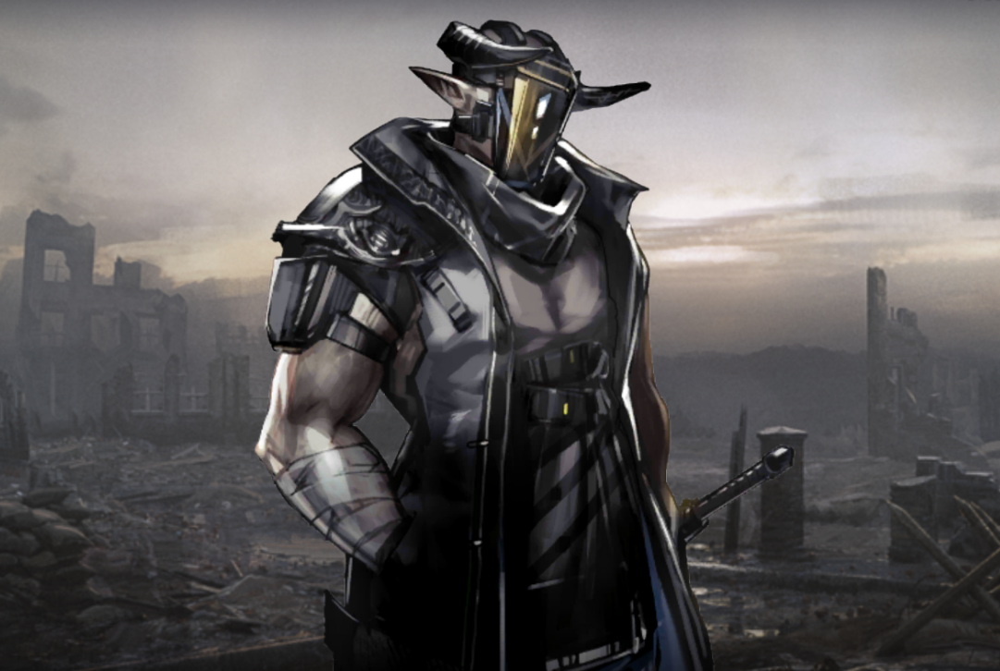

## あいさつ
アークナイツAdvent Calender6日目担当のnozzleです。
アークナイツの有益な情報をシェアできたらと思います。

とはいえ、危機契約#5で最大戦力と人海戦術を駆使して12等級がやっとのドクターに、共有できる有益な情報があるはずありません。

そこで、皆様にとっては周知の事実かも知れませんが、今一度アークナイツの包帯キャラをまとめて列挙してみたいと思います。

。

## 包帯キャラ一覧

**---- _まだ休んじゃダメですよ。_**  
**アーミヤ**
> アークナイツの顔にして、ロドスの最高幹部。  
> ウェイや氷川きよしを相手に臆することなく会話できる。  
  
---

**---- _オムニバスストーリー 戦地の逸話_**  
**エンカク**
> 戦地の逸話PVでナレーションを務めたオペレーター。  
> 今なお入手手段がイベント報酬に限られており、涙を飲むドクターは少なくない。  

---

**---- _お互いどうにか生き残りましょう?_**  
**W**
> サルカズ遊撃隊の幹部で、つかみどころのない人物。  
> 戦友のサポート欄に登場するため、作中で死なないことが確約されている。  

---

**---- _良い部屋ですね。_**  
**マッターホルン**
> シルバーアッシュ一族の執事で料理人。  
> 育ちの良い彼は、どんな部屋でもまず賞賛してくれる。  

---

**---- _良い部屋じゃねぇか。_**  
**ヴァーミル**
> 荒野育ちのハンター。  
> 壁と天井があるだけで部屋を褒めてくれる。  
  
---
  

**---- _ガヴィルを倒す前に、お前で肩慣らしだ。_**  
**フリント**
> フリント族の族長。本名はクマール。
> 背が低い。  

---

**---- _クルース嬢、いやクルース殿！_**  
**ウユウ**
> 画中人に登場した怪しげな男。
人を殺したことがある。  

---

**---- _ここにいたのね〜_**  
**クルース**
> 行動予備隊A1所属オペレーター。  
> クルースが人を殺したことがあるかどうか、誰も知らない。  

---

**---- _ここはウルサス人の墓場よ！_**  
**ウルサス人感染者**
> 7章に登場するウルサス人感染者。本名はタイーシャ。  
> 大学で書記をしていた。

---

**---- _ホントこの大地って不思議がいっぱいだね。_**  
**Aya**
> AUSのボーカル。車推し。

---

**---- _生命たちが渇望してる！音楽を！力を！_**  
**Frost**
> AUSのギタリスト。基本無口だけどしゃべるときはしゃべる。

---

**---- _(このグループに分類されてたら、わたし多分......泣く......)_**  
**ミルラ**
> 薬草を使って治療するオペレーター。
> 苦いらしい。

---

**---- _クリア！_**  
**アンセル**
> 包帯を投げて治療するオペレーター。
> 人任せ？

---

**---- _ぬいぐるみさんは私の宝物だから、私が守るの。_**  
**小さな女の子**
> 彼方を望むで登場する女の子。本名はドーラ。  

---

**---- _それじゃあ俺がわざと隠れてたみたいじゃねぇか。_**  
**ロドスオペレーター**
> ロドスのオペレーター。気さく。  
---  

**---- _ああ、それは何よりだ。_**  
**マドロック**
> 重装オペレーター。Big Bobと仲良し。

---

**---- _傭兵は戦争の道具だ。_**  
**サルカズ戦士**
> サルカズ戦士。やられ役。

---

**---- _善意だけではどうにもならないこともある。_**  
**サルカズ傭兵のリーダー**
> サルカズ傭兵のリーダー。Scoutの戦友。

---

**---- _お前たちは、我らと苦痛を分かち合えるか？_**  
**家畜化のサルカズ戦士**
> ケルシー先生が説明していたので、よく分かりません。

---

**---- _害虫が。_**  
**サリア**
> ライン生命を辞めた人。円満退職ではなさそう。

---

**---- _大丈夫ですよ。私はあなたを信じてますから。_**  
**女性住民**
> サルヴィエントの住人。あだ名は木枠。本名はアニタ。

## 包帯キャラかどうか意見が分かれるキャラ
* スカベンジャー (武器に巻いているだけでは？)
* シャマレ(ぬいぐるみが巻いてるだけでは？)
* ロードローラー・凶漢・サルカズ傭兵・リターニア反乱兵隊長・ウルサス民間人・拳闘士囚人(敵ユニットはキャラではないのでは？)
* ワルファリン(スキル1の名前が救急包帯法ってだけでは？)

## まとめ
アークナイツには**22名**もの包帯キャラが存在する。意外と多いな、案外少ないな、様々な意見が飛び交っていることだろう。これを機に包帯キャラの魅力について語ってもらえたら望外の喜びである。

**---- _包帯キャラが足りない......_**  

**おわり**

‪
‪
‪
‪
‪
‪
‪
‪
‪
‪
‪
‪
‪
‪
‪
‪
‪
‪
‪
‪
‪
‪
‪
‪
‪
‪
‪
‪
‪
‪
‪
‪
‪
‪
‪
‪
‪
‪
‪
‪
‪
‪
‪
‪
‪
‪
‪
‪
‪
‪
‪
‪
‪
‪
‪
‪
‪
‪
‪
‪
‪
‪
‪
‪
‪
‪
‪
‪
‪
‪
‪
‪
‪
‪
‪
‪
‪
‪
‪
‪
‪
‪
‪
‪
‪
‪
‪
‪
‪
‪
‪
‪
‪
‪
‪
‪
‪
‪
‪
‪
‪
‪
‪
‪
‪
‪
‪
‪

**---- _ここ。_**  
**マンティコア**

>「相手に察知されにくい」というすごい能力を持つマンティコア。