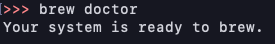

`brew doctor`は brew 関連のインストールの問題をチェックしてくれるみたい

[brew doctor で警告が出た！warning との奮闘記](https://info-wcn.com/brewdoctor-warning01/)

なのでやってみる

```
Please note that these warnings are just used to help the Homebrew maintainers
with debugging if you file an issue. If everything you use Homebrew for is
working fine: please don't worry or file an issue; just ignore this. Thanks!

Warning: Some installed kegs have no formulae!
This means they were either deleted or installed with `brew diy`.
You should find replacements for the following formulae:
  python@2
  mongodb

Warning: The following directories do not exist:
/usr/local/Frameworks
/usr/local/sbin

You should create these directories and change their ownership to your user.
  sudo mkdir -p /usr/local/Frameworks /usr/local/sbin
  sudo chown -R $(whoami) /usr/local/Frameworks /usr/local/sbin

Warning: "config" scripts exist outside your system or Homebrew directories.
`./configure` scripts often look for *-config scripts to determine if
software packages are installed, and which additional flags to use when
compiling and linking.

Having additional scripts in your path can confuse software installed via
Homebrew if the config script overrides a system or Homebrew-provided
script of the same name. We found the following "config" scripts:
  /opt/local/bin/pkg-config
  /opt/local/bin/ncursesw6-config
  /opt/local/bin/aalib-config
  /opt/local/bin/ncurses6-config
  /Users/dubuchen/.pyenv/shims/python3.7-config
  /Users/dubuchen/.pyenv/shims/python3.7m-config
  /Users/dubuchen/.pyenv/shims/python-config
  /Users/dubuchen/.pyenv/shims/python3-config
  /Users/dubuchen/.pyenv/shims/python3.8-config

Warning: Unbrewed dylibs were found in /usr/local/lib.
If you didn't put them there on purpose they could cause problems when
building Homebrew formulae, and may need to be deleted.

Unexpected dylibs:
  /usr/local/lib/libtcl8.6.dylib
  /usr/local/lib/libtk8.6.dylib

Warning: Unbrewed header files were found in /usr/local/include.
If you didn't put them there on purpose they could cause problems when
building Homebrew formulae, and may need to be deleted.

Unexpected header files:
  /usr/local/include/fakemysql.h
  /usr/local/include/fakepq.h
  /usr/local/include/fakesql.h
  /usr/local/include/itcl.h
  /usr/local/include/itcl2TclOO.h
  /usr/local/include/itclDecls.h
  /usr/local/include/itclInt.h
  /usr/local/include/itclIntDecls.h
  /usr/local/include/itclMigrate2TclCore.h
  /usr/local/include/itclTclIntStubsFcn.h
  /usr/local/include/mysqlStubs.h
  /usr/local/include/odbcStubs.h
  /usr/local/include/pqStubs.h
  /usr/local/include/tcl.h
  /usr/local/include/tclDecls.h
  /usr/local/include/tclOO.h
  /usr/local/include/tclOODecls.h
  /usr/local/include/tclPlatDecls.h
  /usr/local/include/tclThread.h
  /usr/local/include/tclTomMath.h
  /usr/local/include/tclTomMathDecls.h
  /usr/local/include/tdbc.h
  /usr/local/include/tdbcDecls.h
  /usr/local/include/tdbcInt.h
  /usr/local/include/tk.h
  /usr/local/include/tkDecls.h
  /usr/local/include/tkPlatDecls.h

Warning: Unbrewed '.pc' files were found in /usr/local/lib/pkgconfig.
If you didn't put them there on purpose they could cause problems when
building Homebrew formulae, and may need to be deleted.

Unexpected '.pc' files:
  /usr/local/lib/pkgconfig/tcl.pc
  /usr/local/lib/pkgconfig/tk.pc

Warning: Unbrewed static libraries were found in /usr/local/lib.
If you didn't put them there on purpose they could cause problems when
building Homebrew formulae, and may need to be deleted.

Unexpected static libraries:
  /usr/local/lib/libtclstub8.6.a
  /usr/local/lib/libtkstub8.6.a

Warning: You have unlinked kegs in your Cellar.
Leaving kegs unlinked can lead to build-trouble and cause formulae that depend on
those kegs to fail to run properly once built. Run `brew link` on these:
  python@2
  python
  node
  unbound
Error: unknown or unsupported macOS version: :mountain_lion
```

多すぎぃ

`Warning: Some installed formulae are deprecated or disabled.`と`need to be deleted`と言われたものは削除することで warning が消えた。

config の重複の問題は brew 実行時に最低限必要な場所でできるようにした。[pyenv をインストールしてると brew doctor で出る Warning を消す方法](https://qiita.com/takuya0301/items/695f42f6904e979f0152)

```zsh:title=./zshrc
alias brew="PATH=/usr/local/bin:/usr/bin:/bin:/usr/local/sbin:/usr/sbin:/sbin brew"
```

link の問題は link すれば直る[Homebrew で doctor したら Warning: You have unlinked kegs in your Cellar となった時の対応方法](https://qiita.com/ponsuke0531/items/80f716c803ac23c7849d)

いらないやつは削除して、必要なものはリンクする。

全部解決したらすっきりした


