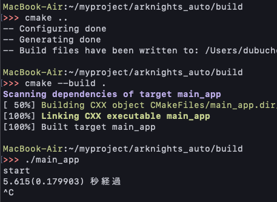

### きっかけ
[アークナイツ自動周回](https://narazuke.github.com/arknights-auto)の記事でc++を使ったが、
コンパイル時にフレームワークやらpkg-configやらを入力していたので、大変。

```shell
g++ -std=c++11 -framework CoreGraphics -framework CoreFoundation main.cpp `pkg-config --cflags opencv4` `pkg-config --libs opencv4`
```

コンパイルしたい時にいちいちメモを開かないといけない。

cmakeを使えばそんなことをしなくていい気がするので使ってみる。


### まずは基本をやってみる

1. main.cppとCMakeLists.txtを書く
```cpp:title=main.cpp
#include <iostream>
int main() {
  std::cout << "Hello, world!" << std::endl;
  return 0;
}
```
```t:title=CMakeLists.txt
cmake_minimum_required(VERSION 3.1)
project(hello_world CXX)
add_executable(main_app main.cpp)
```
2. buildフォルダを作る(ごちゃごちゃするから)
```
<プロジェクトディレクトリ>
|-main.cpp
|-CMakeLists.txt
|-build/
```
3. buildフォルダ内でConfigureとGenerateを実行する
```shell:title=shell
cmake ..
```
`..`はCmakeList.txtの場所を示す


4. ビルドする
```shell:title=shell
cmake --build . 
```
`.`はbuildフォルダを示す


5. 結果


### 実際にcmakeを適用してみる

#### 外部ライブラリの導入
とりあえず上記のCMakeLists.txtのままやってみたら外部ライブラリのincludeでエラーを出したのでやってみる。

`find_package()`で外部ライブラリを探せる。
CMakeLists.txtに`find_package(OpenCV 4.5.1)`という一文を追加したらちゃんと探せた。

```shell:title=shell
-- Found OpenCV: /usr/local/Cellar/opencv/4.5.1_2 (found suitable version "4.5.1", minimum required is "4.5.1") 
```

最終的に[【C++】OpenCV3をOSXにインストールしてcmakeで優勝💪💪【完全に理解した】](https://cha-shu00.hatenablog.com/entry/2018/09/02/143853)
をコピペした

```t:title=CMakeLists.txt
cmake_minimum_required(VERSION 3.1)
project(arknights_auto CXX)
set(CMAKE_CXX_STANDARD 11)
set(CMAKE_CXX_FLAGS "${CMAKE_CXX_FLAGS} -Wall")
find_package(OpenCV 4.5.1 REQUIRED)
include_directories( ${OpenCV_INCLUDE_DIRS} )
add_executable(main_app main.cpp)
target_link_libraries(main_app ${OpenCV_LIBS})
```
`CMAKE_CXX_STANDARD`にはバージョン、
`CMAKE_CXX_FLAGS`にoptionをセットできる。
ここでは直接入力値を代入できるが、`add_definitions`でも設定できる。
`include_directories`でincludeして、
`target_link_libraries`でopencvのライブラリとリンクしている。
フレームワークもこれで指定できる。
でも`target_link_libraries`は使わないライブラリもリンクするからよくないらしい。
CoreGraphicsのフレームワークもこれで入れる。
最終的には次のようにしてコンパイルできるようになった。
```t:title=CMakeLists.txt
cmake_minimum_required(VERSION 3.1)
project(arknights_auto CXX)
set(CMAKE_CXX_STANDARD 11)
add_definitions(-std=c++11 -Wall)
find_package(OpenCV 4.5.1 REQUIRED)
include_directories( ${OpenCV_INCLUDE_DIRS} )
add_executable(main_app main.cpp)
target_link_libraries(main_app ${OpenCV_LIBS})
target_link_libraries(main_app "-framework CoreGraphics")
target_link_libraries(main_app "-framework CoreFoundation")
```




### 参考
[勝手に作るCMake入門 その1 基本的な使い方](https://kamino.hatenablog.com/entry/cmake_tutorial1)

[OpenCV4.1.0をCMakeを使って導入する方法(Visual Studio 2019)](https://qiita.com/sanishi_pompom/items/02b158dfad3a5dafd0a1)

[【C++】OpenCV3をOSXにインストールしてcmakeで優勝💪💪【完全に理解した】](https://cha-shu00.hatenablog.com/entry/2018/09/02/143853)

[CMake覚え書き](https://qiita.com/progrhyme/items/c0f21e2a71cfe6fdb7a8)

最後のリンクは項目化してあってわかりやすい