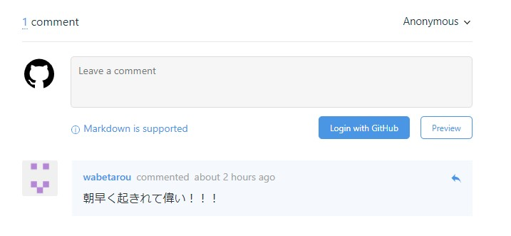
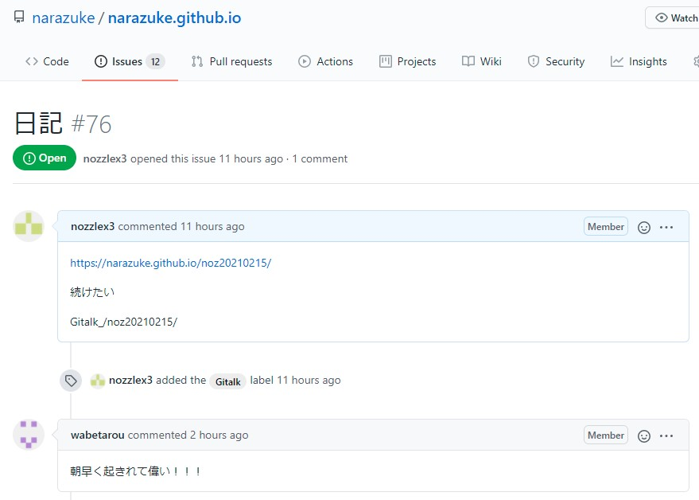
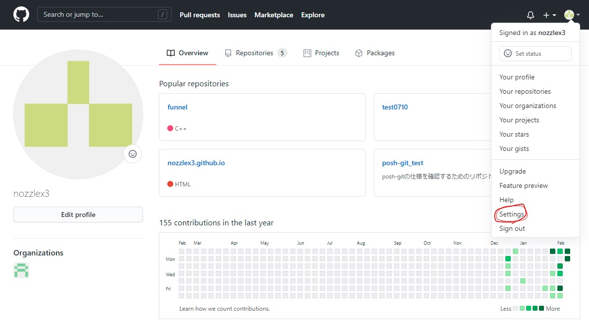
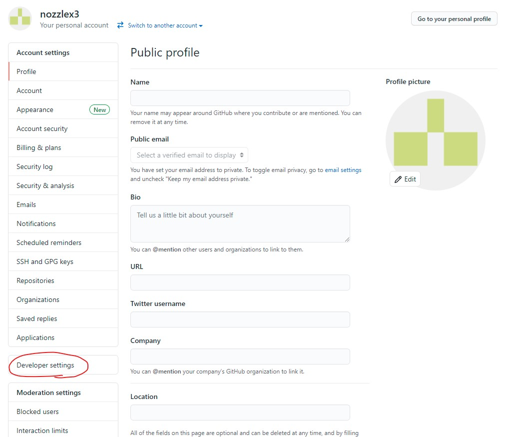
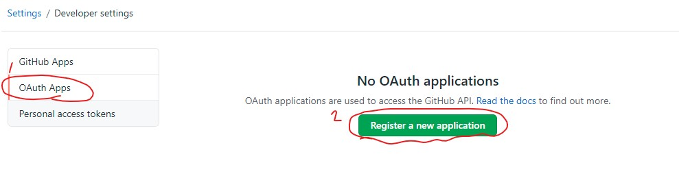
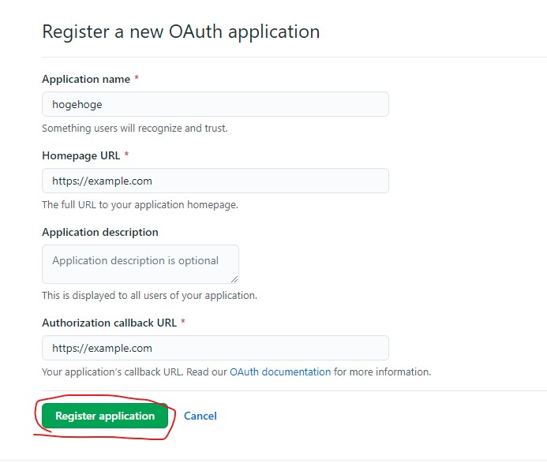
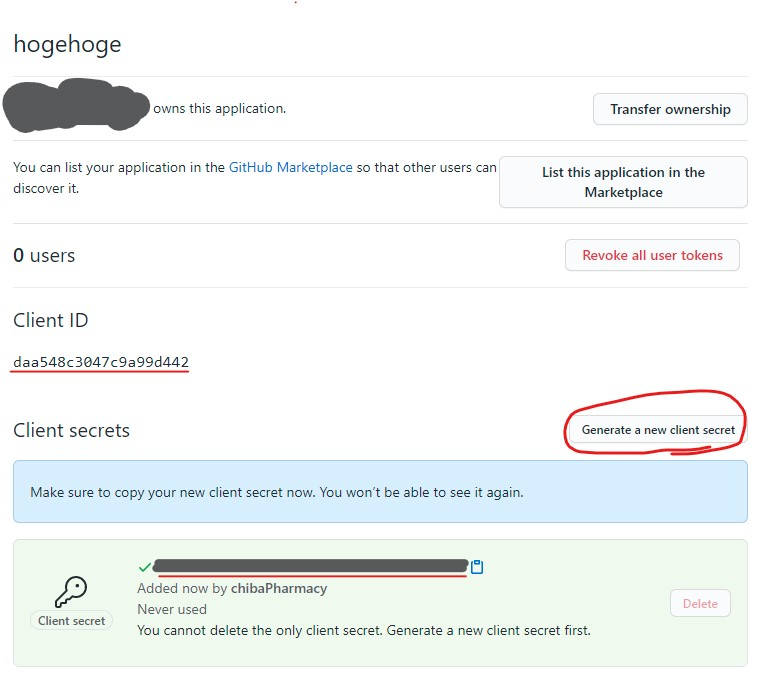
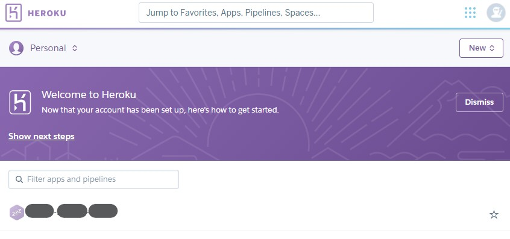

### Gitalk とは

> Gitalk is a modern comment component based on GitHub Issue and Preact.

引用元：[Gitalk | Github](https://github.com/gitalk/gitalk)

Github の issue を利用するコメントのコンポーネントである。
導入することで静的なサイトでもコメント欄が設置できる。


_gatsby の記事に設置された Gitalk のコメント_


_Github の issue 上のコメント_

Gitalk は Github Application を介して、ブログポストごとに新たな issue を立て、ログインしたアカウントでその issue へ返信することができる。  
Gitalk 一連の issue の返信をブログポストへのコメントとして表示する。

### Gitalk の特徴

- サーバーレスで軽い
- コメントを Github の issue で管理できる
- Github のアカウントがないとコメントできない

Github のアカウント必須はデメリットに思えるかもしれないが、自分はメリットだと考えている。  
**理由：Github のアカウントを持っている人は IT リテラシーが高いため。**

## Gatsby に Gitalk を導入

画像を見て理解してほしい。

### Github のプロフィールから settings へ



### Developer settings を開く



### OAuth Apps を選んで、Register a new application を選択



### 必要な情報を入力する

Application name: なんでもいい  
Homepage URL: ブログの URL  
Authorization callback URL: ブログの URL(上と同じ)


### client ID と Client secret を入手する

Generate a new client secret を押して Client secret を発行する。
後で使うのでこのページを残しておくこと。


### Github Application を準備する

### Gatsby 用のプラグインをいれる

[Gatsby Plugin Gitalk | Github](https://github.com/suziwen/gatsby-plugin-gitalk)

```bash
yarn add gatsby-plugin-gitalk
```

### gatsby-config.js に追記する

```javascript:title=gatsby-config.js
module.exports = {
    // 他の設定
    {
      resolve: "gatsby-plugin-gitalk",
      options: {
        config: {
          clientID: [生成したアプリケーションのID],
          clientSecret: [生成したアプリケーションのsecretClient],
          repo: [レポジトリ名],
          owner: [レポジトリのオーナー],
          admin: [レポジトリのオーナー, レポジトリが組織のものならそのメンバー],
          pagerDirection: "first", // コメントが古い順になる
          createIssueManually: false,
          distractionFreeMode: false, // コメント欄にフォーカスした時周囲が暗くならないようにする
          enableHotKey: true, // ctrl+Enterで送信できるようにする
          proxy: "https://cors-anywhere.herokuapp.com/https://github.com/login/oauth/access_token"
        },
      },
    },
}
```

clientID と clientSecret は""で囲む。e.g. `"daa548c3047c9a99d442"`  
repo はレポジトリ名だけでいい。 e.g. `repo: "narazuke.github.io"`

### blog-post.js に追記する

```javascript:title=src/templetes/gatsby-config.js
import "@suziwen/gitalk/dist/gitalk.css"
import Gitalk from "gatsby-plugin-gitalk"
const BlogPostTemplate = ({ data, location }) => {
const post = data.markdownRemark
let gitalkConfig = {
    id: post.fields.slug,
    title: post.frontmatter.title,
  }
  return(
    <div>
        {post.frontmatter.title}
        <Gitalk options={gitalkConfig} />
    </div>
  )
```

参考：[4 plugins to add comments to your Gatsby.js blog](https://blog.logrocket.com/4-plugins-to-add-comments-to-your-gatsbyjs-blog/)

### おわり？

公式の説明だとこれでできるようになるはずだが、2021 年 2 月時点でこの設定だけでは Gitalk が使用できない。次のトラブルシュートを参照してほしい。

## トラブルシュート：ログインすると、Error: Request failed with status code 403 と出てしまう

### 原因

`cors-anywhere.herokuapp.com` の利用に 2021 年 1 月末から制約が生まれたため、Gitalk の処理、`https://cors-anywhere.herokuapp.com/https://github.com/login/oauth/access_token`が動いていないから。

参考：[在授权 gitalk 后出现 403 错误](https://github.com/gitalk/gitalk/issues/429)  
参考：[PSA: Public demo server (cors-anywhere.herokuapp.com) will be very limited by January 2021, 31st](https://github.com/Rob--W/cors-anywhere/issues/301)

### 解説

正直あまり分かっていない。現時点での理解を書き留める。  
あるサイトから別のサイトの情報を利用することを crosssite origin resource share と呼び、略して CORS と言う。  
なんでもかんでも別のサイトから利用されては悪用されるリスクがあるので、通常は CORS が制限されている。CORS するにはアクセストークンで 2 つのサイトを紐付ける必要がある。  
cors-anywhere があれば、どのサイトへどこからでも CORS で入手できる。すごい  
これを使っている cors-anywhere.herokuapp.com は親切な人が動かしてくれてる heroku のアプリで、誰でも無料で使うことができたが、悪用される恐れからこれの利用にも制限がかかった。2020 年 1 月末以降、利用には WEB で一時的に利用制限を解く処理をしなければならなくなった。  
Gitalk は 2020 年 2 月現在特にこの事態に対する処理を追加していないため、Gitalk が使えなくなってしまっている人が出ている。

### 対処法

cors-anywhere ができる herokuapp.com を自分で用意する。

### 手順

heroku のアカウントを作る。
[Heroku](heroku.com)  
heroku コマンドを CLI で使えるようにする。
[The Heroku CLI](https://devcenter.heroku.com/articles/heroku-cli)  
CLI で heroku にログインする。

```bash
heroku login
```

ポップアップを開いてメアドとパスワード打って戻ると、CLI でのログインに成功しているはず。

heroku app を動かす。

```bash
git clone https://github.com/Rob--W/cors-anywhere.git
cd cors-anywhere/
npm install
heroku create
git push heroku master
```

参考：[cors-anywhere.herokuapp.com not working (503). What else can I try? | stack overflow](https://stackoverflow.com/questions/47076743/cors-anywhere-herokuapp-com-not-working-503-what-else-can-i-try)

heroku にブラウザでログインする。

上の画像のように、アプリケーション名が自動で付与されている。

これを元に再び gatsby-config.js を書き換える

```javascript:title=gatsby-config.js
module.exports = {
    // 他の設定
    {
      resolve: "gatsby-plugin-gitalk",
      options: {
        config: {
          clientID: [生成したアプリケーションのID],
          clientSecret: [生成したアプリケーションのsecretClient],
          //
          // (略)
          //
          proxy: "https://[heroku上で見たアプリケーション名].herokuapp.com/https://github.com/login/oauth/access_token"
        },
      },
    },
}
```

heroku のアプリケーション名は「英単語-英単語-5 桁の数字」である。  
例えば、「readable-code-02400」なら、`proxy:"https://readable-code-02400.herokuapp.com/https://github.com/login/oauth/access_token"`である。

### ほんとうのおわり

これで全ての手順が完成した。成功した人はおめでとう。  
できない人は僕より Gitalk の人に聞いた方が良いと思う。
