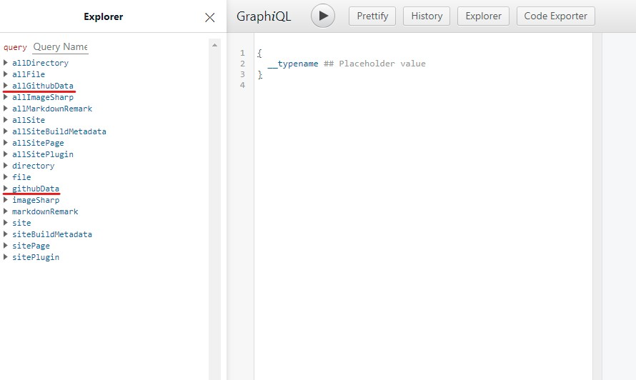

## 仕様

deploy する時に、API で最新のコメントを取得して生成してくれる機能です。  
コメントが投稿される度に更新されるわけではないです。

## 準備

### Github GraphQL API

#### 知る

> GitHub chose GraphQL for our API v4 because it offers significantly more flexibility for our integrators. The ability to define precisely the data you want—and only the data you want—is a powerful advantage over the REST API v3 endpoints. GraphQL lets you replace multiple REST requests with a single call to fetch the data you specify.

引用元：[About the GraphQL API | Github Docs](https://docs.github.com/en/graphql/overview/about-the-graphql-api#overview)

Github は API の方式を REST から GraphQL に移行した。  
REST API では必要ないデータもまとめて取得する必要がある一方、GraphQL はクライアント側が必要なデータを指定して取得できるため効率的。

#### 使ってみる

**知ってる人は飛ばしてください。**  
使ってみるのが一番分かりやすい。  
GraphiQL というグラフィカルなインターフェースを使って API でデータを取得するようすを見てみよう。  
試しに自分のリポジトリとその URL を取得する。

[Explorer | Github Docs](https://docs.github.com/en/graphql/overview/explorer)

  
_explorer の画面_

直接クエリを打ち込んでもいいのですが、データの型が分かりやすいし簡単なので explorer を使います。チェックボックスをクリックするたびに、要求するクエリが作られていくので便利です。

1. 緑色の`Sign in with Github`でログインして Explorer をクリックして数秒待つ。
2. Explorer で`▸user`を見つけてクリック。
3. 紫色の`login`のチェックボックスをクリック。ダブルクォーテーションの間にログイン名を入力。
4. `▸user`下の`▸repositories`を見つけてクリック。
5. 紫色の`last`のチェックボックスをクリック。
6. `▸nodes`を見つけてクリック。
7. `name`と`url`のチェックボックスを見つけてクリック。

これでクエリが完成です。
表示が上のようになってるはずです。

  
_クエリの表示_

8. 中央上の再生ボタンをクリック。○ の中に ▶ が入ってるボタンです。
9. リポジトリ一覧が右に表示されます。

  
_応答_

確認できたと思います。

Gitalk ではリポジトリの issue のコメントを使っているので、この API でリポジトリのコメントを取得できるようなクエリを書きましょう。

自分が書いたものも載せておきます。
narazuke.github.io にある最新 100 件の issue にある、最新 1 件のコメントとその日時とユーザー情報を取得します。

```query
query {
    organization(login: "narazuke") {
        repository(name: "narazuke.github.io") {
            issues(orderBy: {field:UPDATED_AT, direction: DESC}, last: 100) {
                nodes {
                    comments(last: 1, orderBy: {field: UPDATED_AT, direction: ASC}) {
                        totalCount
                        nodes {
                            body
                            author {
                                avatarUrl(size: 10)
                                login
                                url
                            }
                            updatedAt
                        }
                    }
                body
                title
                }
            }
        }
    }
}
```

## gatsby で Github GraphQL API を使えるようにする

### access token を取得する

1. Github の settings から Developer settings を開く
2. Personal access tokens を開いて Generate new token をクリックする。
   
3. repo だけチェックして Generate token をクリックする。
4. token が表示されるのでコピーする。

### plugin を入れる

1. `gatsby-source-github-api`を導入する
   ```bash
   yarn add gatsby-source-github-api
   ```
2. gatsby-config.js に追記する

   ```js:title=gatsby-config.js
   module.exports = {
   plugins: [
   {
       resolve: `gatsby-source-github-api`,
       options: {
       url: "https://api.github.com/graphql",
       token: [Developer settingsで取得したトークン],
       variables: {},
       graphQLQuery: `query {
         organization(login: "narazuke") {
           repository(name: "narazuke.github.io") {
             issues(orderBy: {field:UPDATED_AT, direction: DESC}, last: 100) {
               nodes {
                  comments(last: 1, orderBy: {field: UPDATED_AT, direction: ASC}) {
                   totalCount
                   nodes {
                     body
                     author {
                       avatarUrl(size: 10)
                       login
                       url
                     }
                     updatedAt
                   }
                 }
                 body
                 title
               }
             }
           }
         }
       }`,
     },
   },
   ],
   }
   ```

### localhost の GraphiQL を確認する



githubData と allGithubData の型が出てきたら成功です。あとは graphQL を使ってコメントを表示するプログラムを書きましょう。

奈良漬で使ってるコードを貼っておきます。  
https://github.com/narazuke/narazuke.github.io/blob/develop/src/components/latest-comments.js
