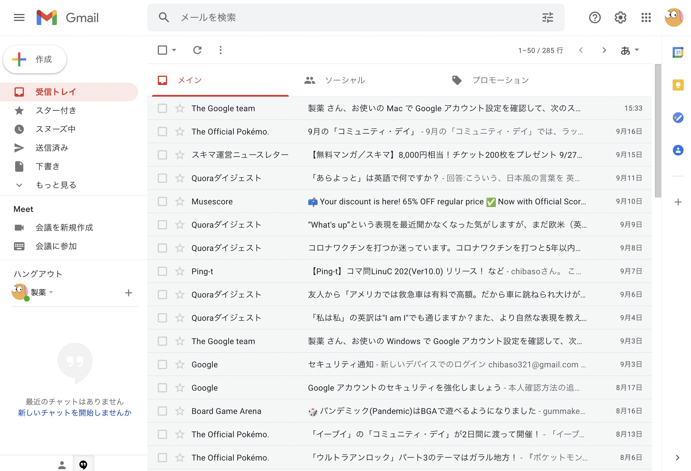

## 最終目標

メルマガが自動的に "magazine" フォルダに分類されるようにする。

## 基礎知識

### エイリアスとは

- example@gmail.com
- example+hoge@gmail.com
- example+foo@gmail.com
- example+bar@gmail.com
- example+piyo@gmail.com

これらは一見、全て違うメールアドレスに見えるが、どのアドレスにメールを送信しても、"example@gmail.com"にメールが届くようになっている。  
この機能はエイリアス機能と呼ばれている。

エイリアスのアドレスの作り方は、アカウント作成時に作ったプレーンな Gmail アドレスの"@"の前に"+"を置いて、適当な文字列をつなげる。

### エイリアスの利点

#### #1 サブアカウント作成

例えば Twitter で、メインのアカウントとは別にサブアカウントが欲しい状況を想定しよう。本来、新規アカウントを開設するには、メインアカウントで使っていたアドレスとは別のアドレスを用意しなければならない。  
しかし、このエイリアス機能を使えば、メインのアドレスに"+hoge"を付けるだけで新しいアカウントとして登録できる。

#### #2 フォルダ分類

用途によって登録するメールアドレスのエイリアスを使い分けると、宛先によってメールをフィルタすることが可能になる。
例をあげよう。

- example+contact@gmail.com (連絡用)
- example+finance@gmail.com (銀行, クレジットカード系)
- example+game@gmail.com (PSN, Steam のアカウント)
- example+subscribe@gmail.com (定期購読サービス)
- example+temp@gmail.com (仮登録したサービス)

このように、用途によってエイリアスを使い分ける。すると、どの宛先に送信されたメールかによって自動でラベルづけを行うことができる。  
メールにつけられたラベルは、他のメールソフトではフォルダとして認識することができる。

つまり、

- contact
- finance
- game
- subscribe
- temp

というフォルダが、受信 BOX とは別にメールソフト上に作られる。

銀行からのメールなどの重要なメールは"finance"フォルダで一元で管理することができる。これなら、重要なメールが広告のメールに埋もれることなく、簡単に確認することができる。

今回は、このエイリアスによったフォルダわけに焦点を置いて説明していく。

## エイリアスによるフィルタリング設定

### フィルターの作成

実際にメールマガジンをフィルタリングしてみよう。

今回、フィルタリング設定は WEB ブラウザで行う。ブラウザから[Gmail](https://mail.google.com)にアクセスしよう。

_[Gmail](https://mail.google.com)_

開けたら、上部の検索欄の右にある、検索オプションを押す。

次に、"To"の欄にフィルタリングしたいアドレスを入力する。今回は僕が使用しているアドレス、"chibaso321@gmail.com"のエイリアスである"chibaso321+magazine@gmail.com"を使う。  
入力し終えたら「フィルタを作成」を押す。

ラベルを付ける: ラベルを選択 -> 新しいラベル...
を押す。

新しいラベル名を入力する。ラベル名はのちにフォルダ名となるため、分かりやすい名前が良い。もしこだわりがなければ、エイリアスに使った文字列を推奨する。下の欄は空欄で OK。「作成」を押して、「フィルタを作成」を押したら完成である。

このフィルタは、"chibaso321+magazine@gmail.com"宛てのメールを受信するたびに、"magazine"のラベルを付けるフィルタである。

### 実践編

実際にメルマガを登録して、メールをフィルタリングしてみよう。

宛て先は、"chibaso321+magazine@gmail.com"となっているのが分かる。

適当なサイトを見つけたので登録する。

受信トレイにメールがあるが、本文の前に`maganize`と付いているのが見える。フィルタによってラベル付けが成功したようだ。

左サイドの"magazine"を押して、該当するメールだけを閲覧することもできる。

## Thunderbird

### Gmail アカウントを Thunderbird に追加する

省略する。  
ちなみに「省略」という意味で「割愛」という言葉を使うのは誤用である。各自調べて見て欲しい。

### Gmail との連携

Thunderbird において、Gmail のラベルの代わりになる機能が、「タグ」である。ラベルがそのままタグになれば便利なのだが、残念ながらそういう移行はできない。しかし、特定のラベルが付けられたメールフォルダを閲覧することができる。

Thunderbird を開くと、先ほど追加したラベルがフォルダとして現れているはずだ。現れない人は一旦 Thunderbird を再起動しよう。

これだけでもう便利だが、ラベルがついたメールフォルダが、受信トレイと同じ階層にいるのはちょっと違和感がある。下書きや送信済みメールの方が本来重要なフォルダなのに、"magazine"の方が階層が上なのもおかしい。

### Thunderbird の設定の見直し

「ツール」 -> 「アカウント設定」を開き、「サーバー設定」のタブを開く。
そして「詳細」を押す。

IMAP サーバーディレクトリーという項目が空になっているはずなので、"[Gmail]"と入力する。

こうすると、IMAP の[Gmail]フォルダの中のみを参照するようになる。"magazine"は消えるが、"受信トレイ"は残る。

### Gmail の設定の見直し

左のバーの「ラベルの管理」からフォルダ分けしたいラベルを編集する。

これを、"[Gmail]/labels/magazine"とする。

受信トレイと同じ階層に"labels"フォルダが現れ、その下の階層に"magazine"フォルダができた。もちろん、このフォルダにはさきほどラベル付けしたメールが格納されている。

### 受信したいフォルダを選択する

「ファイル」->「購読」から Thunderbird に表示するフォルダを選択する。スター付きや重要は不要なのでチェックマークを外す。

### 表示するフォルダを並び替える

「ツール」 -> 「アドオンとテーマ」-> 「アドオンを探す」欄に"Manually sort folders"を入力して検索。  
検索結果が出るので「Thunderbird に追加」を押す。

Thunderbird を再起動してアドオンを有効化する。

「ツール」->「フォルダの並べかえ」でいい感じに並び替える。

いい感じになった。

## まとめ

すでに登録済みのサービスを+hoge 化させるのは面倒だが、自分でタグ付けやフォルダ分類しなくても、重要なメールが一つのフォルダでまとまってくれているのは嬉しい。  
この記事を作る際、画像を多めに貼ってわかりやすくなるように努めた。VSCode の拡張機能に[Paste Image](https://marketplace.visualstudio.com/items?itemName=mushan.vscode-paste-image)があって、スクショして Markdown に貼り付けるだけで画像が保存されるのがとても便利だった。
