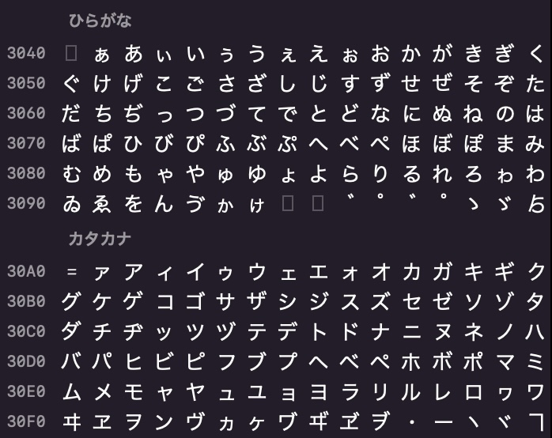

## はじめに
正規表現って覚えにくいですよね。  
そこで、具体的な使用例を考えて正規表現を学ぶというやり方を試してみます。

## Blocktubeとは
### 概要

>  BlockTube
>  WebExtension for Chrome and Firefox.  
>  Filter and block unwanted content from YouTube™.

[blocktube | Github](https://github.com/amitbl/blocktube)
[BlockTube | chrome web store](https://chrome.google.com/webstore/detail/blocktube/bbeaicapbccfllodepmimpkgecanonai?hl=en-US)

BlockTubeは、Youtubeの苦手なビデオを非表示にすることが可能この[](chrome拡張機能)・Firefoxアドオンです。
設定で正規表現を使うことができるので、結果が分かりやすくて便利です。

## 本題
### 使い方
BlockTubeアイコンをクリックすると設定画面が開きます。
この入力ボックスに、正規表現を入力してフィルターを作ることがで20221112143528.png)

入力が終わったら設定画面下部の"Save"を押すのを忘れないように。
設定が保存されると、フィルターが反映されます。

###  基本 
#### "海外の反応"が含まれる動画を非表示にする


*"海外の反応"の検索結果*

僕は海外の反応系の動画が苦手です。理由は内緒です。
まずは、"海外の反応"の動画を全て非表示にしてみます。
BlockTubeの"Video title"の入力欄に、`/海外の反応/`と入力して、"Save"しましょう。


次からこの状態は、以下のように書きます。
```regex
/海外の反応/
```

検索結果の変化を見てみます。


*"海外の反応"の検索結果*

うまく消えていますが、今度は"外国人の反応"が残ってしまいました。

#### "海外の反応"と"外国人の反応"が含まれる動画を非表示にする
同様に外国人の反応も消します。`/海外の反応/`の下の行に`/外国人の反応/`と入力・保存します。

```regex
/海外の反応/
/外国人の反応/
```

再度検索結果を見てみます。


*"海外の反応"の検索結果*

良い感じで消せていますね。

### 応用1
#### "Reaction Mashup"が含まれる動画を非表示にする

海外の反応系の動画の中でも、円卓配置された外人と一緒に無断転載コンテンツを見る動画は、"reaction mashup"と言います。


*"reaction mashup"の検索結果*

これも同様に消すことができます。
正規表現では大文字と小文字を区別するので、`Reaction Mashup`と入力します。

```regex
/Reaction Mashup/
```


*"reaction mashup"の検索結果*

フィルターに"Reaction Mashup"と入力したため、"REACTION MASHUP"と"reaction mashup"が残ってしまいました。

#### flagを指定して大文字小文字を区別しないようにする

まず結論から、`/reaction mashup/i`と入力して下さい。

```regex
/reaction mashup/i
```

2度目のスラッシュのあとに入力した`i`は、正規表現のflag(オプション)を表しています。
指定したflagのおかげで、大文字・小文字の区別しないようにすることができます。


*"reaction mashup"の検索結果*

"reaction mashup"はうまく消せていますが、"react mashup"が残っています。

#### ORを使って複数のフィルタを同時に記述する

まずは結論から、`/(reaction|react) mashup/i`と入力します。

```regex
/(reaction|react) mashup/i
```

`(reaction|react)`は、"reaction"または"react"を表します。
これのおかげで、reaction mashupに関するフィルタを1行で表すことができます。


*"reaction mashup"の検索結果*

まだ、"リアクション マッシュアップ"が残っています。
しぶといですね。

#### 空白の有無を加味した記述をする

よく見ると、同じ"リアクション マッシュアップ"でも間に空白があるものとないものが混在していました。これらも1行で同時に記述することができます。

```regex
/リアクション( )?マッシュアップ/
```

`( )?`は「半角スペースが1つだけある、もしくはない」を表します。
これで、"リアクション マッシュアップ"も"リアクションマッシュアップ"も同時に記述できます。


_"reaction mashup"の検索結果_

まあこんなもんでしょう。

### 応用2
#### 任意のコメントを非表示にする
Youtubeのコメント欄、全部消します。

BlockTubeの入力欄は4つあって、一番下にあるものがコメントに関するフィルターです。
ここに`/.*/`と入力します。


```regex
/.*/
```

解説です。
1.  `.`  (ドット) は任意の文字を表す。
2. `*`   (アスタリスク)は、前の文字が0つ以上あることを表す。

つまり、任意長の任意の文字が該当するので、あらゆるコメントを非表示にすることができます。


*ある動画のコメント欄*

745件もコメントがあるはずが、一つも表示されていません。

#### 日本語のコメントだけを非表示にする

正規表現でひらがなだけを表すときは、`[あ-ん]`と書きます。

正規表現では2つの文字の間に`-` (ハイフン)を挟んで大括弧で囲むと、2つの文字で囲われたUnicodeの範囲の文字を表せます。
`[あ-ん]`は、ひらがな50音を指定しています。

応用として`[a-z]`で小文字のアルファベットを、`[A-Z]`で大文字アルファベットを表せます。
アルファベットを全て指定したいなら、`[A-z]`と書きます。
Unicode表を見ると、なぜ`[a-Z]`ではダメなのかが一目瞭然です。


また、より厳密にひらがなを指定したいなら`あ-ん`より、`ぁ-ゟ`がいいです。



これをふまえて、ひらがな・カタカナが含まれる任意長の文字列を表す正規表現は、以下のようになります。

```
/[ぁ-ゟァ-ヿ]+/
```


また、漢字も同様に指定できますが、Unicodeでは中国日本朝鮮の漢字を区別していないため、それらのセクションを省くと、中国語も表示されなくなってしまいます。

それでも良いなら、ひらがな・カタカナ・漢字が含まれる任意長の文字列を表す以下の正規表現を使いましょう。

```
/[ぁ-ゟァ-ヿ㐀-鿕]+/
```

JIS第1水準〜第4水準の漢字を昇順で並び替えると、`㐂-頻`となるそうなので、これを使っても良いと思います。
ただ、この範囲はJIS第1水準〜第4水準の漢字だけを絞っているわけではないらしいです。

参考：[文字列の中から漢字を抽出する正規表現を考えてみる /[々〆〇〻㐂-頻]+/g | Google Apps Script試行錯誤 Blog](https://www.pre-practice.net/2018/05/blog-post_2.html)

## おまけ
[regex101](https://regex101.com)というサイトで正規表現を簡単に確認できます。

## おわりに
正規表現をマスターして自分だけのエコーチェンバーを作り上げろ！！
