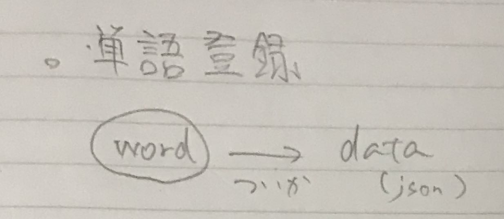
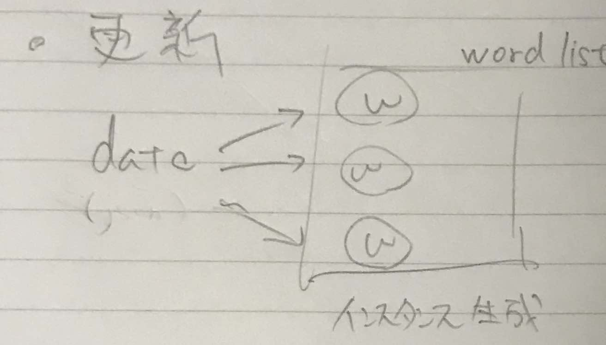
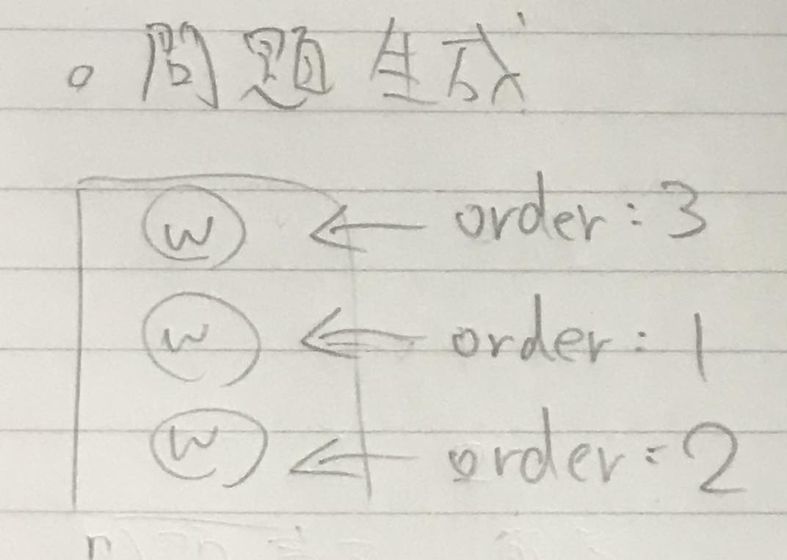
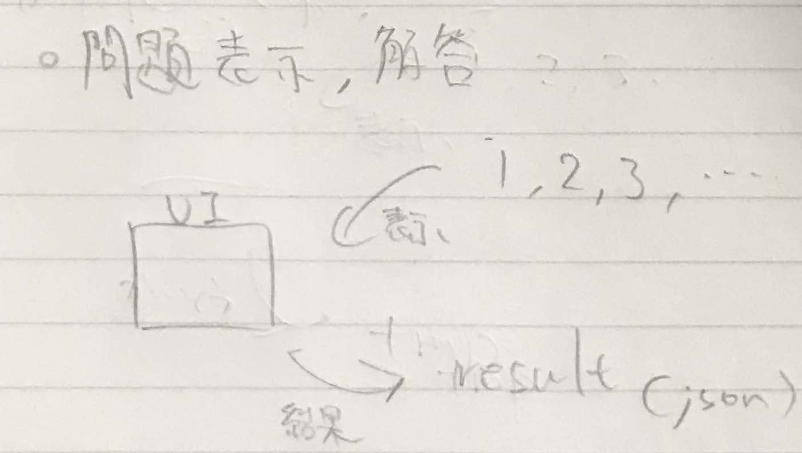
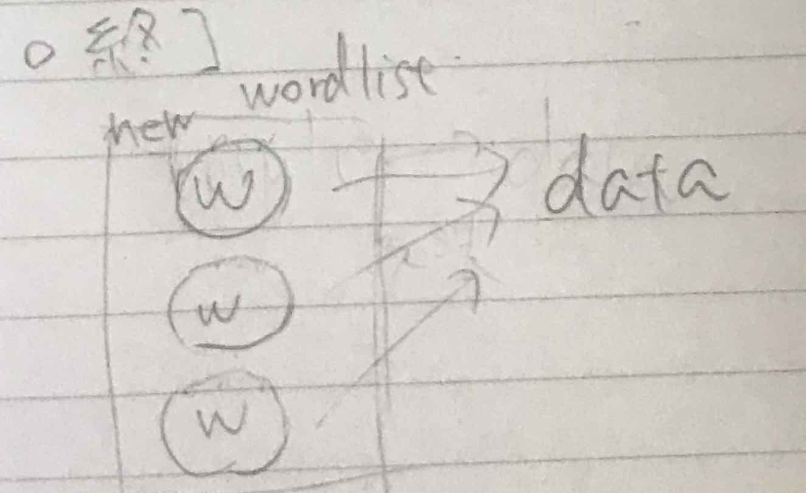

https://github.com/wabetarou/learning-chinese-application/

このツールを起動してから終了するまでに何をするのかの説明
問題提示の順番のアルゴリズムは以下に記載
https://narazuke.github.io/learning-chinese-application/v

## 起動

単語登録か問題解答か選択する

## 単語登録

1. （手動）単語（漢字、拼音、和訳）を記入する
2. 情報を`data.json`に新しく追加する（すでにある場合は更新）
   

## 問題解答

1. `data.json`を元に登録された`word`のインスタンスを生成する
   
2. 生成されたインスタンスを順番付する
   
3. UI に問題を順番に表示
4. （手動）問題に解答する
5. 結果を`result.json`に記録する
   

## 終了

1. `result.json`に記録されたデータを`data.json`に反映する
   
