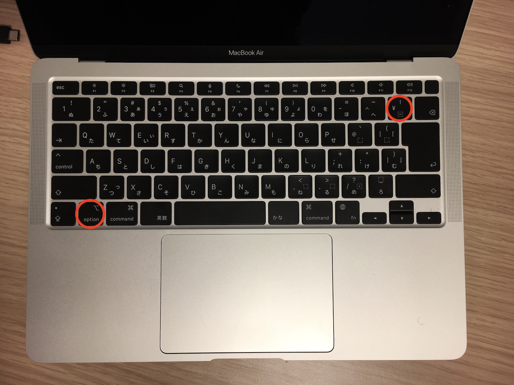
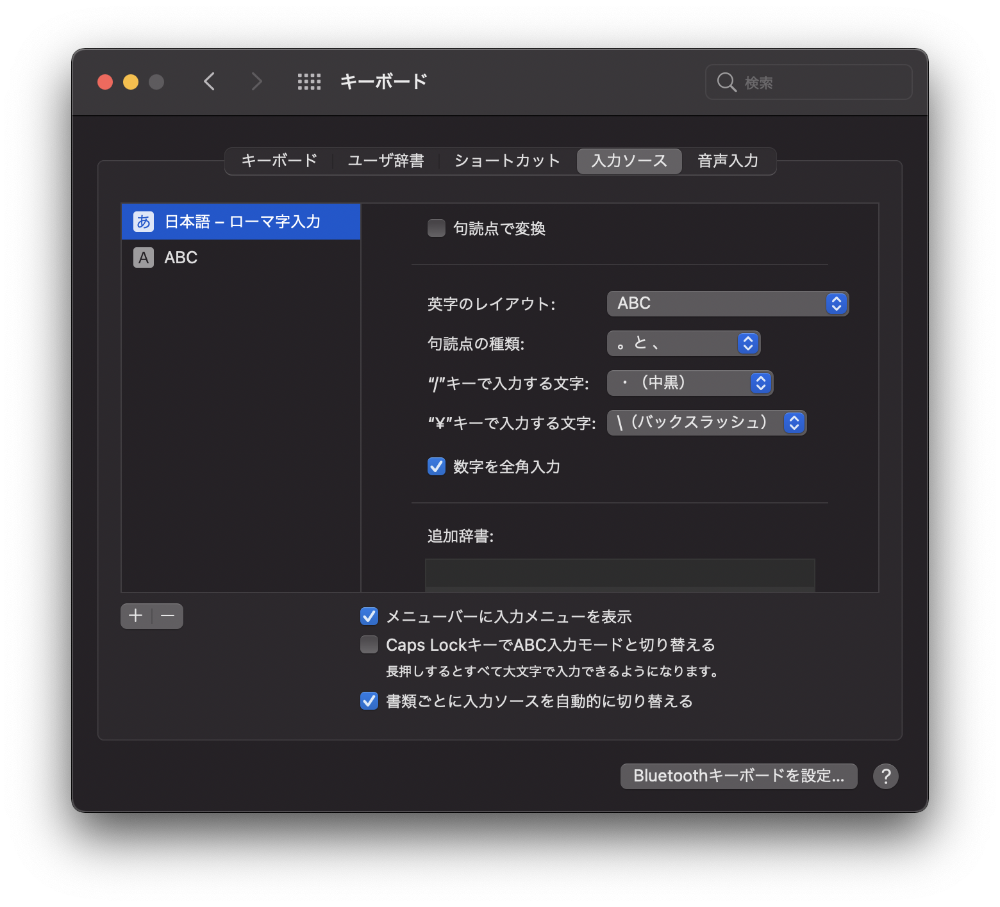
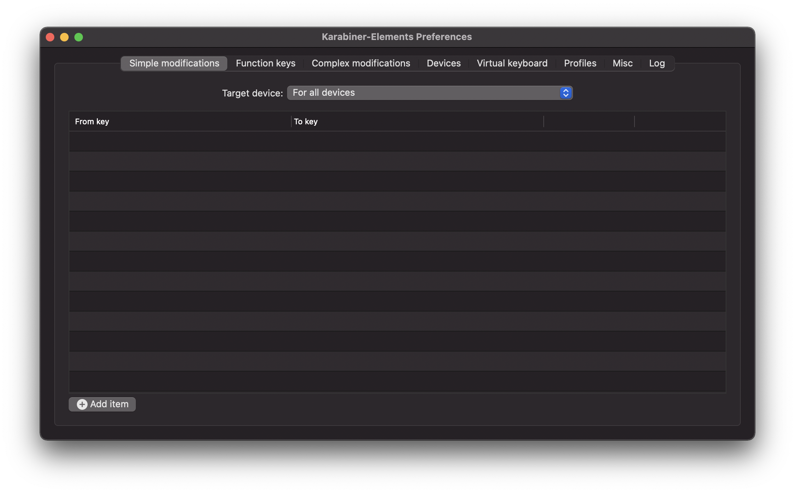

## 正攻法
`option`+`¥`



そのキー間隔たるや脅威の25cm！！！  
両手の小指をぐいっと伸ばすので運動になる。(馬鹿にしてます)  


## 正攻法2
システム環境設定 ⇨ キーボード ⇨ 入力ソース ⇨ "¥"で入力する文字  
これを"¥"から"\\"に変更する。  


すると、"¥"キーを押すだけでバックスラッシュが入力できるようになる。  
ちょっと快適。  

## 裏技 (Karabiner-elements)
### キーボード設定ソフトを使う
Windowsなら右シフトキーの隣はバックスラッシュのキーだった。アンダースコアは`Shift`+`\`で打てた。あのキー設定を再現するためにキーボード設定ソフトを使う。  

### Karaniber-elementsとは
> A powerful and stable keyboard customizer for macOS.

引用元：[Karabiner-elements](https://karabiner-elements.pqrs.org/)

macのキーボード設定をかなり自由に変更できるソフトウェア。無料。  
ソースコードがGithubで公開されているので、安全だと思われます。  

### インストール方法
[公式](https://karabiner-elements.pqrs.org/)からダウンロードする。  dmgファイルを開くとインストールウィザードが開いて、このソフトにキーボード設定を変更できる権限を与える。ポップアップの指示に従えば難しくない。  

### 設定一覧

- Simple modifications: キーの役割を変更する  
e.g. `caps lock`を押すと`Ctrl`が反応する  

- Function keys: Fnキー(F1,F2, ...)の役割を変更する  
e.g. `F5`を押すとキーボードのバックライトが明るくなる
- Complex modifications: それ以外の複雑な設定全部  
e.g. `Ctrl`と`option`と`v`を同時に押すとVS Codeが起動する  

- Virtual keyboard: 
- Profiles: 
- Mics: 
- log: 

上の4つは特に使わない。  

今回は、**`_`キーを`\`に変更する**のが目的だから、Simple modificationsを使うと思いきや、これだとうまくいかないので、Complex modificationsを使います。

### オリジナルルールを作ろう

`~/.config/karabiner/assets/complex_modifications/`以下にjsonファイルでオリジナルルールを作成可能。  
複数のキー入力をあるキー入力に変換させるルールを作ります。  
ルールといっても、詳しい作り方は公式のドキュメントかQiitaの記事を読んだ方がいいです。  
僕は既存のルールをコピーして細部を変更しただけです。  

```json:title=/home/[user]/.config/karabiner/assets/complex_modifications/hogehoge.json
{
  "title": "My rules",
  "rules": [
    {
      "description": "Change underscore to backslash",
      "manipulators": [
        {
          "from": {
            "key_code": "international1"
          },
          "to": [
            {
            "key_code": "international3",
            "modifiers": [ "option" ]
            }
          ],
          "type": "basic"
        }
      ]
    }
  ]
}
```

`international1`は`_`のkey code  
`international3`は`¥`のkey codeを表しています。  

追加したら、karabiner-elemetsを開いて、Complex modificationsのAdd ruleを開いて、"Change underscore to backslash"をEnableにする。


### 他の人が公開しているルールをもらおう

Complex modificationsのAdd ruleからImport more rules from the Internet (open a web browser)を押すと、他の人が作ったルールをImportできる。  

- [Left ctrl + hjkl to arrow keys Vim](https://ke-complex-modifications.pqrs.org/#ctrl_plus_hjkl_to_arrow_keys)

    Ctrl押すとvimバインドが使えてホームポジションから手が動かなくておすすめです。