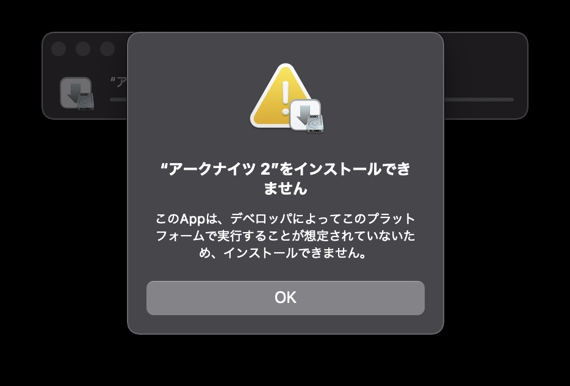

## 経緯

Macbook Air を買った。(2021/02/26)

## 端末について

### Pros

- 安い
- 薄い
- 静音かつ熱もない
- マウスパッドが広くて使いやすい(3 本指で画面切り替える機能が良い)
- Thunderbolt の type-C 端子 (type-C 対応のディスプレイがあれば、画面の外部出力と充電を一本で同時にできる)

### Cons

- 重い
- 天板を開閉するときに掴む部分まで液晶なので指紋が必ず付く
- キーボードが打ちにくい(キーストロークが浅い)

## Mac OS について

### Pros

- ...
- ...
- ~~アークナイツができる~~  
  (追記：2021/05/05)  
  2021 年 5 月 5 日現在、プレイできない。  
  以前は App Store からダウンロードできたが、できなくなっている。過去にダウンロードした人も、アップデートを促されてしまう。ちなみにリンクを踏んでも App Store は起動しない。  
    
  iMazing などの ipa ファイルをエクスポートするソフトウェアを用いて最新版をダウンロードしようとすると、エラーが出てインストールが途中で止まる。  
    
  _アークナイツ２！？_

### ブチギレ案件

- ~~バックスラッシュが option と ¥ の同時押し~~  
  キーボード設定やソフトウェアで楽に入力できる  
  参考：[Mac でバックスラッシュを入力する | NARAZUKE](https://narazuke.github.io/mac-backslash)
- 全画面表示中にタブ操作とか URL 打ち込もうとすると、メニューが降りてきて操作がズレる
- Touch ID は再起動しても使えるようにしてほしい (正直これはそんなにキレてない)
- ~~起動音がうるさい~~  
  環境設定で再生しないようにできる

## メモ

- アプリケーションのアンインストールはゴミ箱にドラッグ&ドロップするだけで可能
- ファイル名変更は F2 ではなく ENTER
- 右クリックは 2 本指タッチでできる. 押し込まなくて良い

## まとめ

店員が Apple Care をずっと勧めてきてつらかった。  
端から加入する気ないのに善意で話を聞いてしまったばかりにお互い得しない時間を過ごしたと思う。  
嫌なことにはちゃんと NO って言えるのが本当の信頼関係だと思いませんか。
