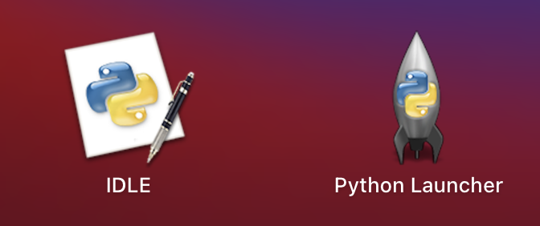

## まとめ

個人ブログとか Qiita の記事は参考になるが情報が古いことがある。複数のソースを探したり更新日を確認したりするのも大事だが、公式を見た方が良い。  
1 ユーザがなんとかできる問題じゃないことが多いので、できない時は素直に諦めた方が良い。

## Homebrew

### 公式

> Today I’d like to announce Homebrew 3.0.0. The most significant changes since 2.7.0 are official Apple Silicon support and a new bottle format in formulae.

引用：[3.0.0 | Homebrew](https://brew.sh/2021/02/05/homebrew-3.0.0/)

ARM 版と x86 版が混在してた時期もあったが、ver3.0.0 で正式に対応したらしい。

### メモ

公式のインストール方法をやりました。

```bash:title=zsh
/bin/bash -c "$(curl -fsSL https://raw.githubusercontent.com/Homebrew/install/HEAD/install.sh)"
```

`brew`が`/opt/homebrew/bin/brew`に入った。  
これは ARM 版らしい。 x86 なら`/usr/local/bin/brew`に入るから。

`lipo -archs $(which hoge)`でアーキテクチャを調べられるらしいけど、

```
fatal error: /Applications/Xcode.app/Contents/Developer/Toolchains/XcodeDefault.xctoolchain/usr/bin/lipo: can't figure out the architecture type of: /opt/homebrew/bin/brew
```

って出て怒られた。
ちなみに`mv`とか`ls`とか`vim`とか`git`とかは universal(どっちも OK)だった。

brew の PATH を追記しろって言われるので追記しよう

```bash:title=.zshrc
eval $(/opt/homebrew/bin/brew shellenv)
```

なにこれ？  
`export PATH=$PATH:/opt/homebrew/bin` で良くね？

```bash:title=bash
echo $(/opt/homebrew/bin/brew shellenv)
# export HOMEBREW_PREFIX="/opt/homebrew"; export HOMEBREW_CELLAR="/opt/homebrew/Cellar"; export HOMEBREW_REPOSITORY="/opt/homebrew"; export PATH="/opt/homebrew/bin:/opt/homebrew/sbin${PATH+:$PATH}"; export MANPATH="/opt/homebrew/share/man${MANPATH+:$MANPATH}:"; export INFOPATH="/opt/homebrew/share/info:${INFOPATH:-}";`
```

どうやら brew の PATH 以外にもいろいろやってくれるらしいので、素直に公式の言うことに従いましょう。

## Anyenv

pyenv とか nodenv とか rbenv とかの全部入りパック。

### インストール

```bash:title=zsh
brew install anyenv
```

PATH を通す

```bash:title=.zshrc
eval "$(anyenv init -)"
```

### プラグインのインストール

anyenv が参照するバージョンをアップデートしてくれる

```bash:title=zsh
mkdir -p $(anyenv root)/plugins
git clone https://github.com/znz/anyenv-update.git $(anyenv root)/plugins/anyenv-update
```

これで`anyenv update`をターミナルに打つだけでアプデできる。

## Python

### 最初から入ってたやつ

- python ... 2.7.16
- python3 ... 3.8.2

### 公式

> 3.9.1 is the first version of Python to support macOS 11 Big Sur. With Xcode 11 and later it is now possible to build “Universal 2” binaries which work on Apple Silicon.

引用：[Python 3.9.1 | python](https://www.python.org/downloads/release/python-391/)

3.9.1 が初めて Apple Sicion で動くバイナリをビルドできるバージョンらしい。

### pyenv

pyenv は python のバージョンを切り替えられるパッケージ。  
詳しくは、[pyenv と venv で仮想環境構築 ラズパイ編](https://narazuke.github.io/pyenv-venv-virtual-environment/)を見よう。

pyenv は`brew install pyenv`でインストールできる。  
`anyenv`を導入した人は`anyenv install pyenv`でインストールできる。

### トラブルシュート：pyenv install で 3.9.0 以前の python がインストールできない

#### エラー文

```bash:title=zsh
$ pyenv install 3.8.8
python-build: use openssl@1.1 from homebrew
python-build: use readline from homebrew
Downloading Python-3.8.8.tar.xz...
-> https://www.python.org/ftp/python/3.8.8/Python-3.8.8.tar.xz
Installing Python-3.8.8...
python-build: use readline from homebrew
python-build: use zlib from xcode sdk

BUILD FAILED (OS X 11.2.2 using python-build 1.2.23-54-gabcbf6e1)

Inspect or clean up the working tree at /var/folders/ng/t866684x2y301n0c8mqgwj0c0000gn/T/python-build.20210310163954.14672
Results logged to /var/folders/ng/t866684x2y301n0c8mqgwj0c0000gn/T/python-build.20210310163954.14672.log

Last 10 log lines:
checking size of _Bool... 1
checking size of off_t... 8
checking whether to enable large file support... no
checking size of time_t... 8
checking for pthread_t... yes
checking size of pthread_t... 8
checking size of pthread_key_t... 8
checking whether pthread_key_t is compatible with int... no
configure: error: Unexpected output of 'arch' on OSX
make: *** No targets specified and no makefile found.  Stop.
```

確かに、3.9.1 が Xcode で build できる最初のバージョンという声明に嘘偽りはありませんでした。

#### 対処法

pyenv でパッチを当ててインストールすればできる。  
正直どうしてできるか分かってない。

```bash:title=zsh
PYTHON_CONFIGURE_OPTS="--enable-framework" pyenv install --patch 3.8.7 <<(curl -sSL "https://raw.githubusercontent.com/Homebrew/formula-patches/9811be33170a8f31a684fae6955542e31eb4e61e/python/3.8.7.patch")
```

参考：[M1 MacBook での開発環境構築 | Qiita](https://qiita.com/hjmr/items/b81de997d4c2b64ef140)


_誰だお前は!?_

この方法でインストールするとアプリ版もついてくるらしい。やめてほしい。

## poetry

### poetry とは

> Poetry is a tool for dependency management and packaging in Python. It allows you to declare the libraries your project depends on and it will manage (install/update) them for you.

引用：[Introduction | poetry](https://python-poetry.org/docs/)

python のパッケージ管理を便利にしてくれるやつ。  
`venv`みたいなやつだけど、仮想環境の情報が残ってくれるのであとから見ても使いやすいのでこっちに乗り換えた。

### インストール方法

```
curl -sSL https://raw.githubusercontent.com/python-poetry/poetry/master/get-poetry.py | python -
```

いつもの PATH 通すやつをやる

```bash:title=.zshrc
export PATH="$HOME/.poetry/bin:$PATH"
```

poetry の使い方とかもメモしたいけど、とりあえずインストール方法と.zshrc の追記内容に留める。

### トラブル：poetry add opencv-python するとエラーを吐く

#### エラー文

```bash:title=zsh
EnvCommandError

(中略)

  at ~/.poetry/lib/poetry/utils/env.py:1074 in _run
      1070│                 output = subprocess.check_output(
      1071│                     cmd, stderr=subprocess.STDOUT, **kwargs
      1072│                 )
      1073│         except CalledProcessError as e:
    → 1074│             raise EnvCommandError(e, input=input_)
      1075│
      1076│         return decode(output)
      1077│
      1078│     def execute(self, bin, *args, **kwargs):

```

解決してません。

## Node.js

### nodenv

#### インストール

node のバージョン管理してくれるやつ。  
nodenv には nodebrew と nvm というライバルが 2 人いる。  
anyenv はぶっちゃけ名前で nodenv を選んでそうに思える。

nodenv は`brew install nodenv`でインストールできる。  
`anyenv`を導入した人は`anyenv install nodenv`でインストールできる。

#### 使い方

```bash:title=zsh
nodenv install --list       # インストール可能なnodeのバージョンを一覧表示
nodenv install x.x.x        # バージョン x.x.x をインストールする
nodenv versions             # インストールしたnodeのバージョンを一覧表示
nodenv global x.x.x         # どのシステムでもバージョンx.x.xのnodeを使う
nodenv local x.x.x          # 現在のディレクトリではバージョンx.x.xのnodeを使う
```

### トラブルシュート："FATAL ERROR: wasm code commit Allocation failed - process out of memory"とでて、パッケージを入れられない

#### 対処法

node のバージョンを 15.3.0 以降にすると治る  
安定版っていうから 14.16.0 を入れたのに...  
参考：[wasm code commit Allocation failed - process out of memory | stack overflow ](https://stackoverflow.com/questions/65856300/wasm-code-commit-allocation-failed-process-out-of-memory)

## Git

### 基本設定

```bash
git config --global user.name "Yamada Hanako"
git config --global user.email "yamahana@takaka.com"
git config --global color.ui auto
git config --global core.editor "vim"
```

[git 備忘録 | NARAZUKE](https://narazuke.github.io/git-memorandum/)

### 補完

```bash:title=zsh
mkdir ~/.zsh
cd ~/.zsh
curl -o git-prompt.sh https://raw.githubusercontent.com/git/git/master/contrib/completion/git-prompt.sh
curl -o git-completion.bash https://raw.githubusercontent.com/git/git/master/contrib/completion/git-completion.bash
curl -o _git https://raw.githubusercontent.com/git/git/master/contrib/completion/git-completion.zsh
```

.zshrc に追記する

```bash:title=.zshrc
source ~/.zsh/git-prompt.sh
fpath=(~/.zsh $fpath)
zstyle ':completion:*:*:git:*' script ~/.zsh/git-completion.bash
autoload -Uz compinit && compinit
GIT_PS1_SHOWDIRTYSTATE=true
GIT_PS1_SHOWUNTRACKEDFILES=true
GIT_PS1_SHOWSTASHSTATE=true
GIT_PS1_SHOWUPSTREAM=auto
setopt PROMPT_SUBST ; PS1='%F{green}%n@%m%f: %F{cyan}%~%f %F{red}$(__git_ps1 "(%s)")%f\$ '
```

メモとはいえまるパクリで申し訳ない。  
Qiita サービス終了に備えて書き置きしておきます。
下の参考記事を読もう。

これやるとユーザ名が緑になるし、ディレクトリもフルパスが出るようになって最高！zshrc の設定ものちのちやりたい。

参考：[【zsh】絶対やるべき！ターミナルで git のブランチ名を表示&補完【git-prompt / git-completion】| Qiita](https://qiita.com/mikan3rd/items/d41a8ca26523f950ea9d)

## SSH

### 秘密鍵と公開鍵の作成

```bash:title=zsh
ssh-keygen -t rsa -b 4096 -C "hoge@hogenomacbookair"
```

`-C`でつけるコメントには、"github のアカウントのユーザとメアド"派と、"端末のユーザ名とホスト名"派がいる。

参考：[お前らの SSH Keys の作り方は間違っている | Qiita](https://qiita.com/suthio/items/2760e4cff0e185fe2db9)

github の setting に登録したらあとは`ssh -T git@github.com`してちゃんとできてるか確認すればいい。

### config を作る

```bash:title=.ssh/config
Host hoge
  HostName 192.168.1.x
  User foo
  Port 10022
  IdentityFile ~/.ssh/id_rsa
```

こんな感じで作れる

## VS Code

VS Code はまだ Apple Silicon に対応していないが、Insiders 版が対応している。  
とはいえ、Insiders 版にしなくても支障がないと思われます。

どうしても Insiders 版を使いたい人は以下からダウンロードできる。

[Download Visual Studio Code Insiders | Visual Studio Code](https://code.visualstudio.com/insiders/)

```bash:title=zsh
lipo -archs /Applications/Visual\ Studio\ Code\ -\ Insiders.app/Contents/MacOS/Electron
# arm64
```

確かに、arm64 版であることを確認しました。

Insiders 版はターミナルから起動する時、`code-insiders`と入力する。長いので.zshrc でエイリアスを登録する。

```bash:title=.zshrc
alias code='code-insiders'
```
