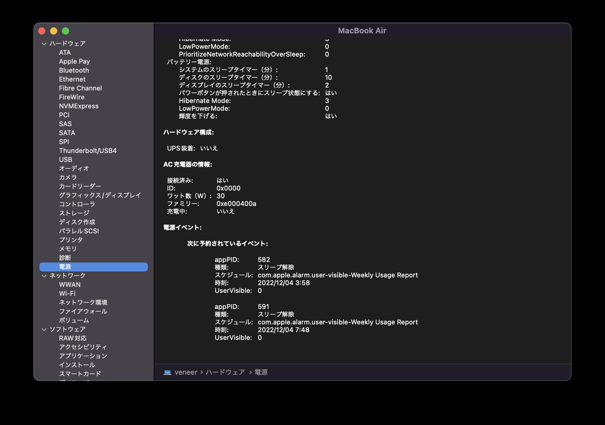

## 方法1
リンゴアイコン->このMacについて->システムレポート->電源
の下の方にワット数が書いてある


## 方法2
terminalで、`system_profiler SPPowerDataType | grep Wattage`を実行
```
$ system_profiler SPPowerDataType | grep Wattage
      Wattage (W): 30
```