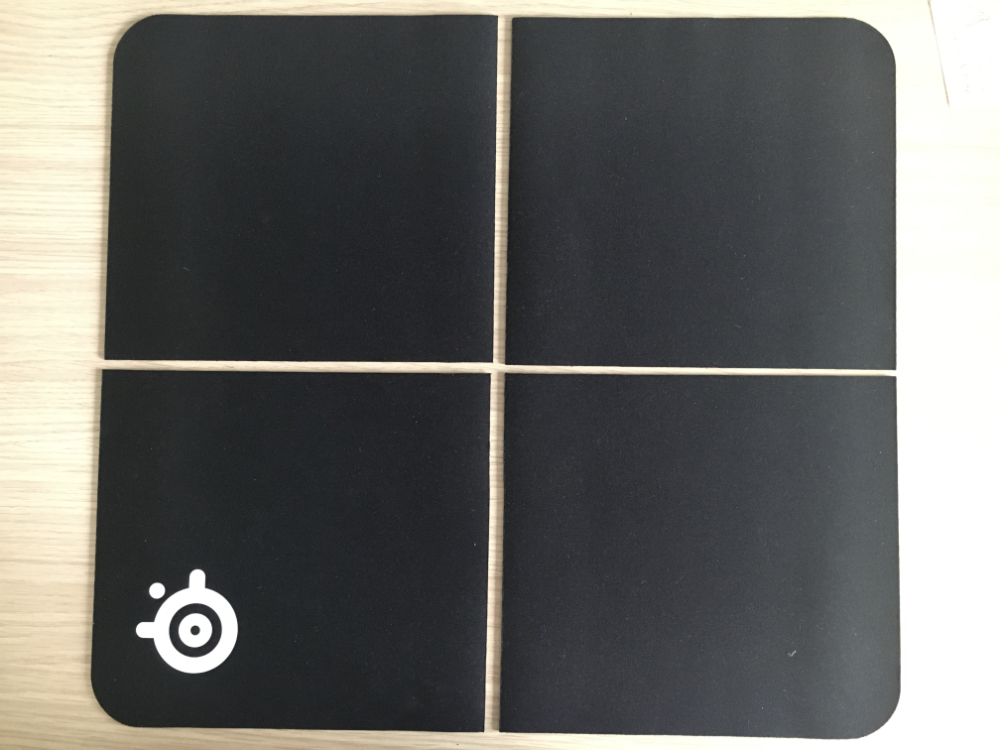
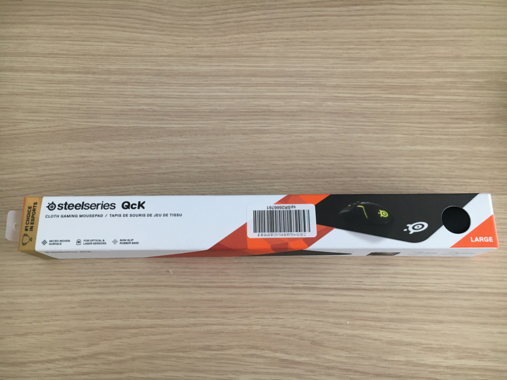
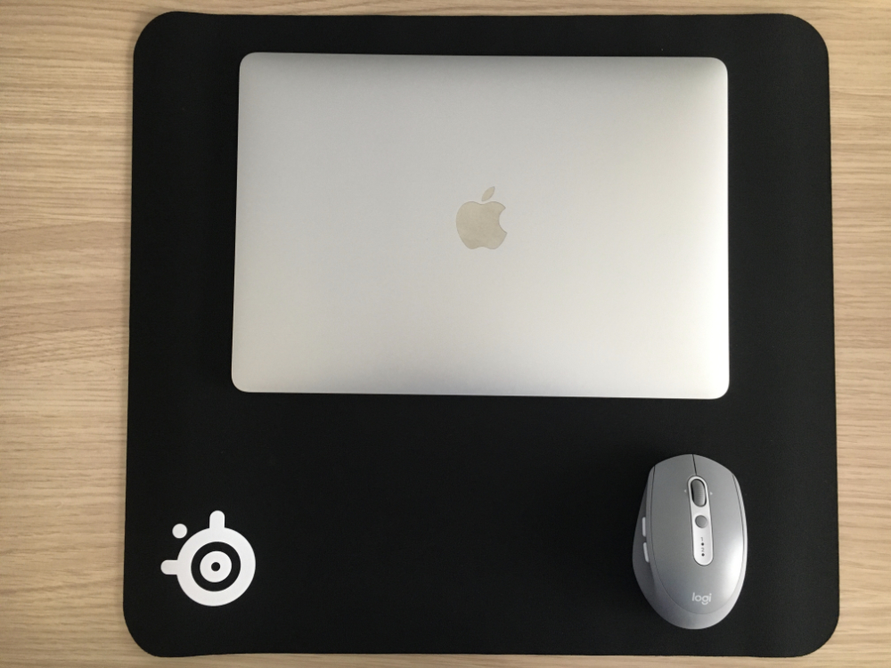
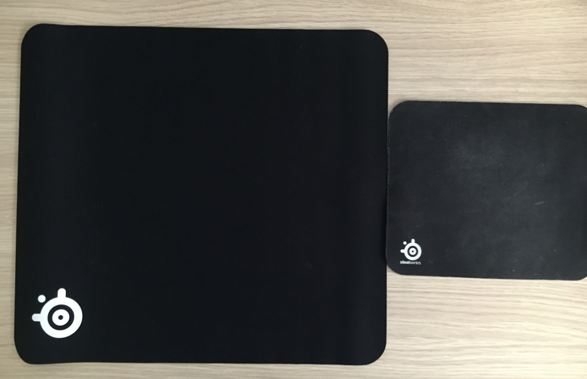

## 結論

_どりゃ！！！！！_

## アイデア元
マウスパッドのレビューです.  

> **サイズに悩んだらこれを買うべし**  
> どのサイズにしようか悩んでいました。  
> しかし、これを買って自分の好みのサイズに切れば良いんじゃないか？と思い、購入。  
> 予想は的中し、切っても切り口がほつれるようなことはなし。  
> というか、この製品自体が切断面の処理をしておらず、  
> 私がハサミで切った断面と全く同じです。  
> ハサミは裁縫用の大きなハサミをお勧めします。  
> 1/4に切り、大満足。ミニサイズ4枚分ですよ。  
> もしや、コスパ最強なのでは？  

引用元：[valleyseedさんのカスタマーレビュー - SteelSeries QcK + マウスパッド | Amazon ](https://www.amazon.co.jp/gp/customer-reviews/ROTIEVW13GIE1/ref=cm_cr_othr_d_rvw_ttl?ie=UTF8&ASIN=B000UEZ37G)

もともと, QcK mini (25cm x 21cm) っていうマウスパッドを使ってたんだけど, この人の言う通り, Lサイズ(45cm x 40cm) を四等分すれば, 確かにminiサイズになる.  

## 購入

PCよりでかいマウスパッドは初めて見た.  

これをカッターで切った.  
カッターで綺麗に切るコツは, 最初は軽く何回もなぞって, 切断するラインを確定させてから切ることです.  

4等分すると, 若干miniより小さい.  

## 感想
ぴったり切れたときが気持ちよかった.  
miniサイズで十分な人ならこのサイズでも問題ないです.  

