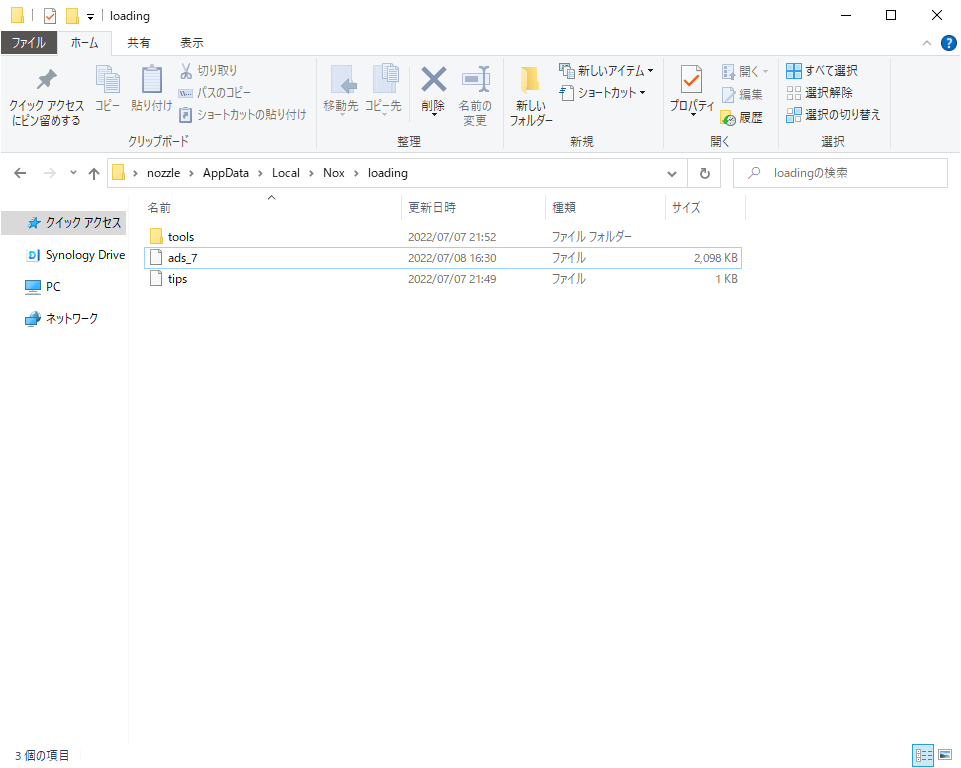
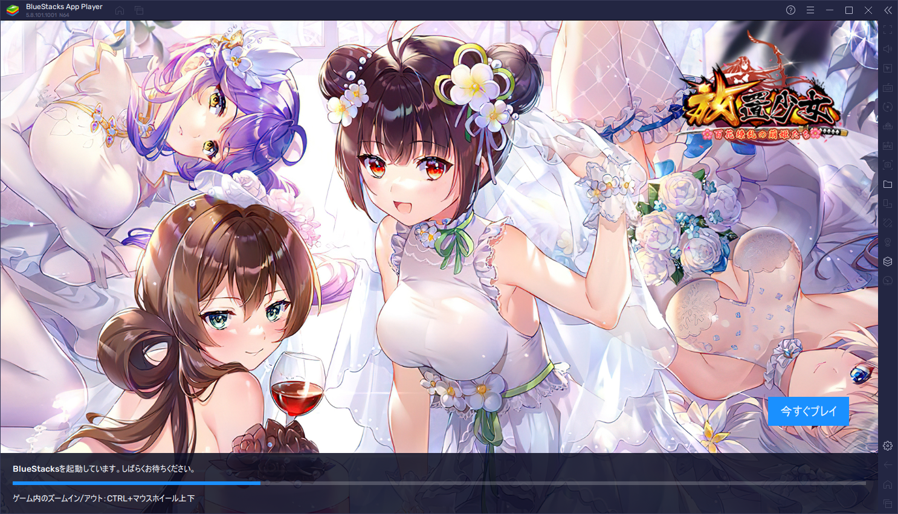

## 経緯
Androidエミュレータを使うと、PCでモバイルのゲームができて便利です。  
Nox Playerと呼ばれる有名なエミュレータがあります。
このNox Player デフォルトの設定では広告やら不要なアプリやらが満載で使いづらいので、うまく設定して快適な環境を作りましょう。  
今回扱うのは、Windows版のNox Playerです。

## ダウンロード


公式からダウンロードします。  
2022年7月7日時点の最新バージョンは7.0.3.1。

[NoxPlayer公式サイト](https://jp.bignox.com)  


ストレージをCドライブとDドライブで運用しているPCの場合、デフォルトのインストール先がDドライブになっています。  
Dドライブに`Program Files`ができるのが嫌な人は、インストール先を`C:\Program Files\NOX`に変更しましょう。

## 設定
### ホーム画面の変更


これが初回起動時の画面です。
デフォルトでアプリがいくつか配置されています。これらはPlayストアへのリンクとなっていて、いわゆる広告のようなものです。  
これを消しましょう。


### 他のランチャーの導入

PlayストアはToolsの2ページ目にあります。  
Googleアカウントでログインしましょう。  


適当なランチャーをインストールしましょう。  
Nova Launcherがおすすめです。  


インストールしてホーム画面に戻ろうとすると、ホームアプリを選択するポップアップが出るので、インストールしたランチャを選びます。


これは既定値でOK。


これがNova Launcherの初期画面です。  
すっきりしていてていいですね。これでもう80%くらい満足です。  

### Noxの標準ランチャーを無効化する
このままだと、ふとした拍子にNoxの標準ランチャーに切り替わることもあるらしいので、無効化しておくといいです。


アプリファイルを編集するため、エミュレータ内での管理者権限を取得します。
右上の歯車から設定を開きましょう。  
基本タブを選びRoot起動にチェックをいれて、設定を保存を選択します。  
すると、再起動するように言われるので再起動します。


Root起動したらPlayストアで適当なファイラアプリをダウンロードしましょう。  
Solid Explorerがおすすめ。  


ファイラを開いて、`/root/system/app/launcher`を開きます。  


このディレクトリにある`launcher3.apk`がNox標準ランチャーなので、名前を変更して使えなくしましょう。後ろに`.bak`をつけておくと分かりやすいです。

このままその他のデフォルトアプリも無効化しましょう。  
```
# 無効化したアプリ一覧
## デフォルトのファイルマネージャ
AmageFileManager/AmageFileManager.apk

## Noxのアプリストア
## リンクを踏むと結局Playストアに飛ぶし、iOSのアプリストアと同名だし散々
AppStore/appStore.apk

## Androidのスクリーンセーバ
BasicDreams/BasicDreams.apk

## Androidのブックマークプロバイダ
BookmarkProvider/BookmarkProvider.apk

## Androidの標準ブラウザ
## ホームがNoxのホームページになってて嫌だ
Browser/Browser.apk

## Androidの標準カメラ 
## 起動しても真っ暗で使えない
Camera2/Camera2.apk

## イースターエッグ
EasterEgg/EasterEgg.apk

## Facebook
Facebook/Facebook.apk

## Androidの標準写真閲覧アプリ
## なんか権限が多かったので消しておく
Gallery2/Galley2.apk

## Androidの標準キーチェーン
KeyChain/KeyChain.apk

## Noxの標準ランチャ
Launcher/launcher3.apk

## Android標準の動く壁紙ピッカー
## なにそれ
LiveWallpapersPicker/LiveWallpapersPicker.apk

## Android標準のおすすめサービス表示
PrintRecommendationService/PrintRecommendationService.apk

## Andoird標準の単語帳
UserDictionaryProvider/UserDictionaryProvider.apk

## Android標準の壁紙バックアップ
WallpaperBackup/WallpaperBackup.apk

```

<!-- ## Androidの標準FMラジオ
## とされているけど正体がわからない
## パッケージ名が`com.pekall.fmradio`、アプリ名はGoogleSign、起動するとPlayストアが起動し、Googleアカウントのログインを促される。アプリのファイル名はgpLoginで、google play loginのことだろうが、一体なんなんだろう
## というわけで消す
gpLogin/gpLogin.apk -->


#### 余談


`/etc/hosts`も編集できる。  
管理者権限があるうちに編集しておくといいでしょう。  


### 起動時の広告を消す
<blockquote class="twitter-tweet"><p lang="ja" dir="ltr">Nox起動するときにアークナイツの広告がなぜか出るようになった。昨日くらいから急に。<br>怒号光明かな？かっこいいですね . . . 。 <a href="https://t.co/yI8YF7Xiha">pic.twitter.com/yI8YF7Xiha</a></p>&mdash; ち兎せ (@Lagomutry) <a href="https://twitter.com/Lagomutry/status/1399518498854871042?ref_src=twsrc%5Etfw">June 1, 2021</a></blockquote> <script async src="https://platform.twitter.com/widgets.js" charset="utf-8"></script>

上のツイートの方のように、Nox Playerの起動時には、アプリの広告が流れます。  
これも設定で無効化できます。  



`C:\[username]\AppData\Local\Nox\loading`をエクスプローラで開きます。  
この、`ads_7`というファイルが、ロード中に現れるhtmlファイルです。  
これを空のhtmlファイルに書き換えます。


```html:title=\[username]\AppData\Local\Nox\loading\ads_7
<html></html>
```


最後に`ads_7`をプロパティから読み取り専用にします。  
Nox側から書き換えられなくなります。

ちなみに同ディレクトリにある`tips`は起動時のtipsを表示する際に参照されます。


#### 余談


BlueStacksという別のエミュレータでも、同様に広告が出ます。  
このエミュレータの起動時の広告を消す方法が分からないので、Noxを使っています。  

## 終わりに
広告をブロックする行為は、サービスを提供してくれる人を苦しめる行為です。  
もしサービス利用者がみんな広告ブロックしてしまうと、サービス提供者は広告収入がなくなってしまい、結局サービスを運用できなくなってしまいます。大好きなサービスが存続してほしいなら、広告を見たり有料版を使ったりして還元しましょう。  
ちなみに、Noxの有料版はデフォルトのランチャーの下の広告が消えるだけで、起動時の広告が消えるわけではないのでダメダメです。  

引用：[NoxPlayer広告ブロック版に関する詳細 | NoxPlayer　サポート](https://support.bignox.com/ja/often/noads)

## 参考
[Nox App Playerを最適化する | krbysh.net](https://krbysh.net/post/debloat-optimize-nox/)
[Androidのいらないアプリを全部消そう！！！！！！au、docomo、softbank、Sony、Samsung編 | note](https://note.com/nekofuton/n/nae2421530dc1)  
[android常用应用的包名和startAcitivity名 - android - | 一流楼主](https://www.16lz.com/android/kitob.html)