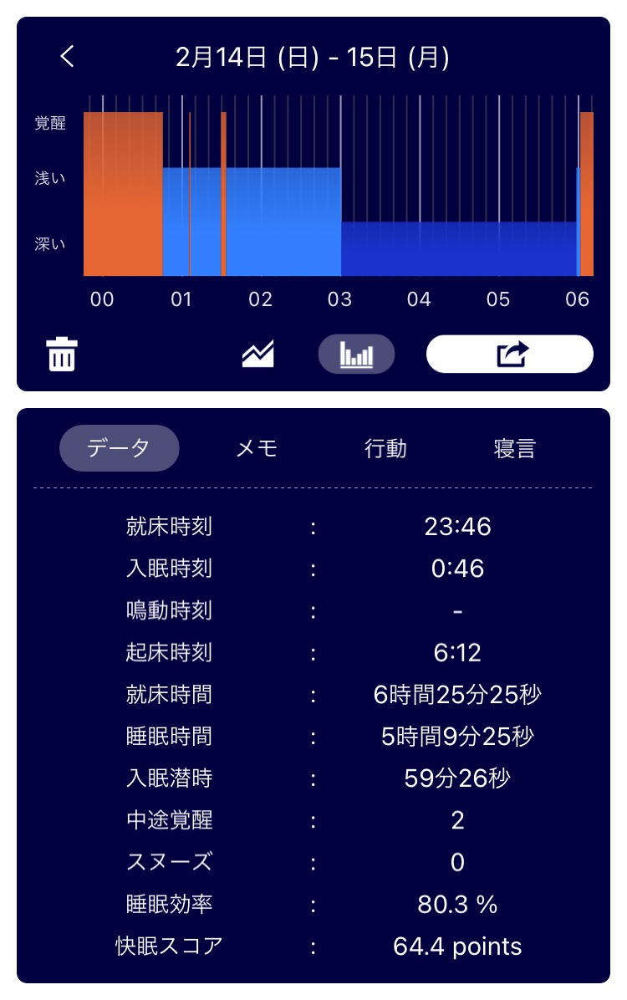
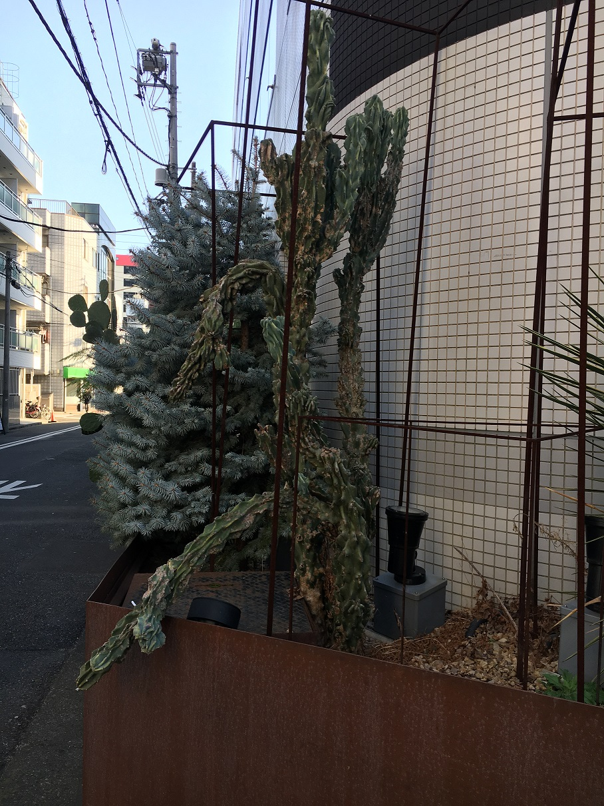

## 日課

### 早起き

早起きできた。やはり日付が変わる前に床につくのが大事よね。  
懺悔すると 6:00 頃目が覚めて 30 分くらいアークナイツやってた。覚醒後の貴重な時間を無駄にした...??  
6:30 にはやめてラジオ体操第一第二やった。  
睡眠記録として sleep meister のスクショ貼っとくけど、見にくいからどうにかしたいと思っている。  
睡眠記録垢の Twitter を埋め込むのが楽そう。

### 散歩

行ってきた。
7:00 から 7:15 まで家の周りをぐるぐるした。  
散歩に行ったら一枚写真を撮ろうと思う。  
でも今日撮影したものは地名が写ってたので、代わりの画像をあげます。  
今度から気をつけます。

_ほうれんそうの胡麻和えみたいなサボテン_

### 歯磨き

歯磨きに専念できた。  
「歯ブラシを洗面所から出さない」をモットーにした。フロスもした。出血した。  
歯医者に行って歯石とりたい。

### English

[Restaurant Owner Goes Viral after Responding to Influencers | Daily News Artible](https://www.rarejob.com/dna/2021/02/15/restaurant-owner-goes-viral-after-responding-to-influencers)

#### My summary

A owner of the restrant in Barcelona offered the influencers the meal for free through the exposure on social media.  
He asked the influencers to refer to what was happening to restaurants in Barcelona during the pandemic.  
Many Twitter users praised what he and the restaurant did.

#### Discussion

**Do you think the owner of Topik was right to turn down the influencers? Why or why not?**  
Yes, I think so. He has right to choose appropriate influencers to promote the restaurant.

**Do you think Topik's response will have a huge impact on the influencers? Why or why not?**  
No, I don't. I suppose that having meal for free is not so attractive for the influencers. They are just interested in how to go viral on the Internet.

**If you had a business, would you hire an influencer to promote it? Why or why not?**  
Yes I would. Many people has social media accounts and use it everyday. Influencer post to promote a business will be spread widely. It is a good advertising.

#### New words

- **bring in (phrasal)** : to cause someone or something to come to a place  
  The new campaign will bring in more activists.
