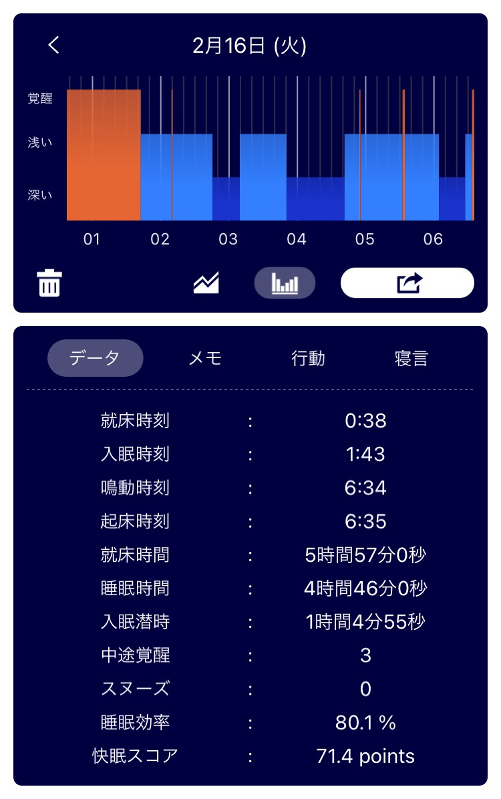
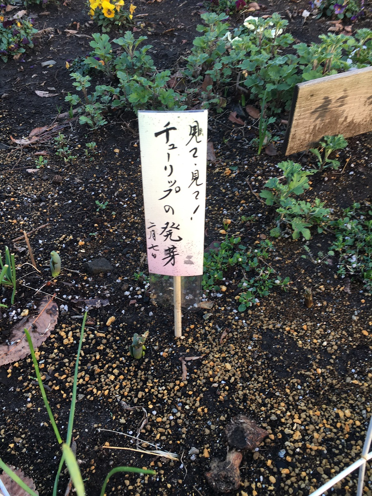

## 日課

### 早起き

まあまあ早起きできた。6:30 にラジオ体操がかかるようにアレクサに言っておいたけど、今日は布団の中で聞き流してしまった。  
布団から出られたのは 7:00 ぐらい、体操はした。  
Twitter の埋め込みできてないのでまたアプリのスクショを貼る。  
就床時刻に比べて入眠時刻が遅い。結局寝たの 1:43 かよ......

### 散歩

行ってきた。
7:15 から 7:30 まで家の周りをぐるぐるした。  
案外地名ってどこかしこにあって、特定されない写真を取るのも大変。  
マンホール,道路標識,看板......考えるとほんとに地名だらけだ。  
なんとか一枚撮影できたけど、今後散歩コースを変えないとネタが尽きそう。

_発芽の喜びが伝わってくるプレート_

### 歯磨き

昨夜も今朝も歯磨きに専念した。  
フロスもした。ちょっと出血した。  
うがいすると冷水が歯にしみる。これって普通？それとも異常？

### English

[Fitbit Replaces Some of Its Smartwatches over Hardware Issues | Daily News Article](https://www.rarejob.com/dna/2021/02/16/fitbit-replaces-some-of-its-smartwatches-over-hardware-issues/)

#### My summary

Fitbit replaced some products of smartwatch over the problem about inconclusive health reading.  
Fitbit sense can dectect heartbeat, track stress and read the wearer's temperture.  
Some users send an e-mail that the units of the smartwatch worked impropoerly. Fitbit clarified the message was legitimate.  
The study found that users who went to the doctor after getting abnormal readings did not atcually have health problems. It would take time away from the doctor.

#### Discussion

**If you were one of the people who got a defective smartwatch, would you rather receive a replacement or a refund? Why?**  
Yes I would. Once I received a defective product, I wouldn't be able to trust their product anymore.

**Which smartwatch feature interests you the most (e.g. reminders to drink water, blood pressure monitor)? Why?**  
Reading heatbeat feature interests me the most. I want to monitor the changes in my heartbeat when I exercise.

#### Expression

- The spring vacation lasts for a month.
- It lasts until March.
- I will rephrase the sentence.

#### New words

- **scam (noun)** : a clever but dishonest way to get money  
  The message from anonymous looks a scam.
- **apprehensive (adj)** : worried about something  
  Many people who have never been on a plane before were apprehensive about flying.
- **inconclusive (adj)** : not leading to a definite answer or conclusion  
  He needs to get another checkups because the results of it were inconclusive.
- **malfunction (verb)** : to not work properly  
  It was very hot in our office when the air conditioner malfunctioned.
