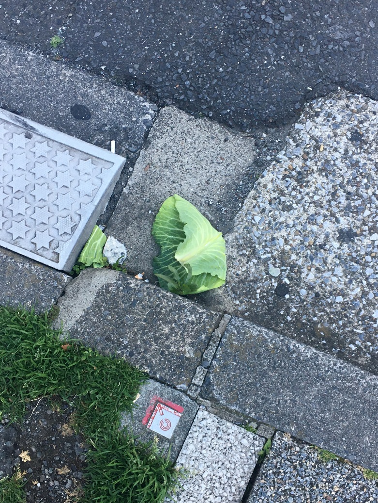
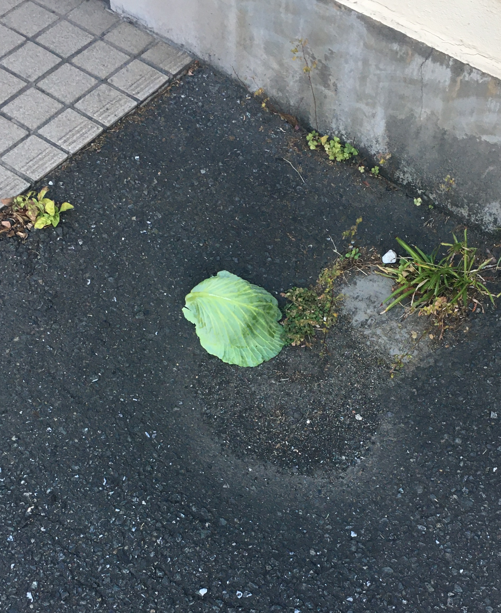

## 日課

### 早起き

早起きできた。アレクサいつものありがとう。  
ラジオ体操第二をお手本無しでできる才能を持ってます。  
Twitter の埋め込みが失敗してるので、またスクショを貼ります。  
5 時間半しか寝てないらしい。  
就床時間と睡眠時間の差が分かりません。

### 散歩

行ってきた。
7:00 から 7:20 まで。写真のために今日は少し遠出した。  
駐車場に右翼の宣伝カーがとまってた。面白いので写真を撮りたかったが後が怖いので諦めた。  
煽り運転から身を守る方法を友だちと考えたことを思い出した。結論としては、「『右翼
』と『左翼』と『共産主義』と『平和主義』と『核廃絶』と『原発推進』と『 9 条廃止』といった矛盾するシールを貼りまくってビビらせる」でした。

_街キャベツ探訪_

### 歯磨き

昨夜も今朝も歯磨きに専念した。  
歯磨きしている間何もしないのに慣れなくて、ぴょんぴょん跳ねてる。

### English

[Man Leaves Fortune to Museum Cats | Daily News Article](https://www.rarejob.com/dna/2021/02/17/man-leaves-fortune-to-museum-cats/)

#### My summary

A French national inhereted his fortune to the cats in the State Hermitage Museum in Russia.  
The cats, called Hermitage cats, were brought to the museum in order to keep rodens off the premises.
About 50 cats were living in the basement of the museum. They were taken care by the museum staff and supported by the donation.

#### Discussion

**Do you think that Botar’s decision to leave some of his inheritance to the cats was reasonable? Why or why not?**  
No, I don't think so. According to this article, he had not ever been to Russia. It is unreasonable to inherit his fortune to the cats.

**Who/What would you like to leave your inheritance to? Discuss.**  
Firstly, my relatives. Secondly, I would like to donate to charity.

#### New words

- **bequeath (verb)** : to leave something, usually a personal possesion or property, to someone after one dies  
  Ella's grandparents bequeathed half of their money to her.
- **premises (noun)** : an area of land, or other property received from a person tho has died  
  Alcohol is not allowed on school premises.
- **testament (noun)** : evidence of the existence or truth of something  
  Maria's clothes are a testament to her sense of style.
- **rodent (noun)** : any small animal of the type that has long sharp front teeth, such as a rat or a rabbit  
  Small desert rodents and the Bedouin goat can survive short periods of dehydration which result in a 20-30 percent weight loss.
