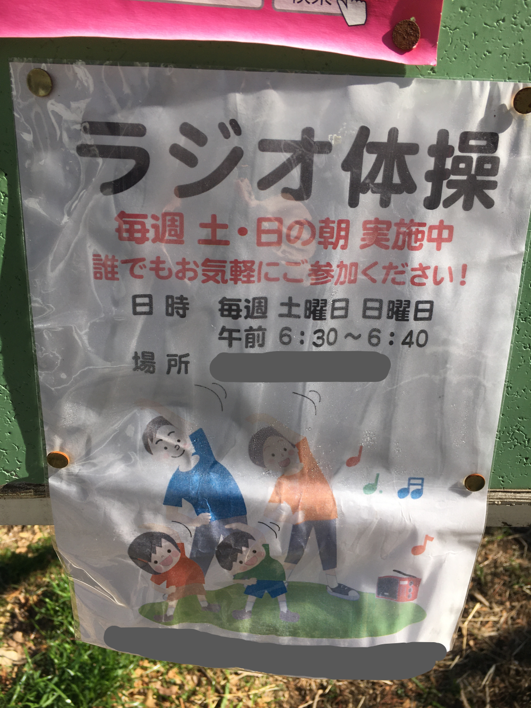

## 日課

### 早起き

できませんでした。  
昨日夜 21:00~23:00 くらいまで寝てしまったから、夜なかなか眠れなかった。  
2:30 に寝たのがそもそも悪い。目覚ましは 6:30 に止めたが、布団から出たのは 8:00 だった。  
体操もしてない。反省。

### 散歩

行ってきた。
10:30 から 10:50 まで。この時間になるとさすがに人がたくさんいる。  
今日はちょっと暖かったね。

_ラジオ体操第二でマウント取りに行こうかな_

### 歯磨き

昨日、洗面所にスマホ持ち込んだ、自分の作ったルールくらい守れ。
フロスはした。出血せず。

### English

[Smartphones Show Real-Time Impact of Social Environments on Health](https://www.rarejob.com/dna/2021/02/18/smartphones-show-real-time-impact-of-social-environments-on-health)

#### My summary

A smartphone-based survey was conducted by Cornell University sociologists. They asked participants to take note of scenes that they considered unplesant. They also asked participants to complete the sueveys within 10 to 15 minutes on their smartphones. The collected data is used to analyze the effects of social environments on a social health.
Unlike pen-and-paper surveys, smartphone-based data collection allowed the researchers to gather more timely responses and get more accurate results.

#### Discussion

**Aside from the scenes mentioned in the article (i.e. litter, damaged sidewalks), what other scenes in one’s environment can affect one’s health (e.g. a noisy bar, heavy traffic)? Discuss.**  
Smokes of cigarette, birds boops, and air pollution can affect it.

**Do you think it is possible to completely avoid distressing scenes? Why or why not?**  
No I don't think so. If all the stressful things that exist now were removed, we would still find new stresses, without realising their usefulness.

#### New words

- **litter (noun)** : small pieces of trash thrown on the ground in public places  
  We volunteered to help pick up litter in the park.
