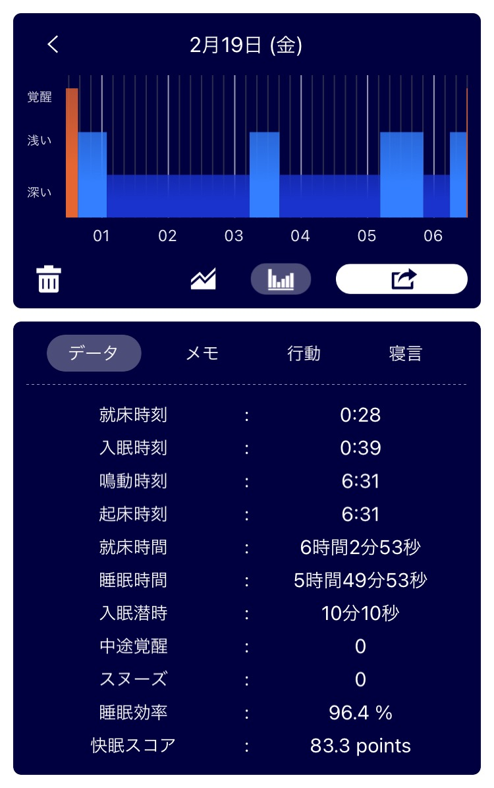

## 日課

### 早起き

できた。  
6:30 のラジオ体操を止めたのは良くなかったが、5 分後にすぐ布団を這い出してラジオ体操できた。  
こうして就寝時間を見直すと、「たいしたことしてないんだから日付変わる前に寝ればいいのに」って毎回思う。  

### 散歩

行ってきた。
7:05 から 7:20 まで。散歩コースを変えた。  
寒かった。一枚多く着ていって良かった。  
このお花は一昨日撮った。牡丹だと考えていたが調べたら葉の質感が違うから別の種類の花らしい。

_誰か教えて下さい_

### 歯磨き

昨日の夜、洗面所にタブレット持ち込んだよ。  
夜は自分に甘くなりがち。  
今朝のはみがきは集中できた。

### English

[Google Now Lets Users Take Street View Photos Using Smartphones | Daily News Article](https://www.rarejob.com/dna/2021/02/19/google-now-lets-users-take-street-view-photos-using-smartphones)

#### My summary

With the new update, Google Street View allows to users take and submit photos using their smartphones.  
The update aims to cover unmapped areas and keep Google's database up-to-date.  
Google's augmented reality (AR) technology help it orient the images correctly on the map.  
When faces and licence plates are appeared in the photo, Google blurs them to protect their privacy.

#### Discussion

**Do you often use online maps?**  
Yes I do. When I visit new places, I always use it. Online map displays the current location and the destination. It's convenient.

**Do you agree with Google’s decision to accept photos from anyone for their online map? Why or why not?**  
Yes I do. If the sights are very different from the photos on the street view, people will be confused. It is important to make the photos up-to-date.

**Do you think Google should pay people who provide photos for the online map? Why or why not?**  
Yes I do. Google can save time and cost by collecting data from users. Google should return the profit to users.

#### Expression

- **I just drank tea.**

#### New words

- **stitch (verb)** : to make (something) out of many different things  
  Google automatically rotetes, positions and stitches the photos together.
