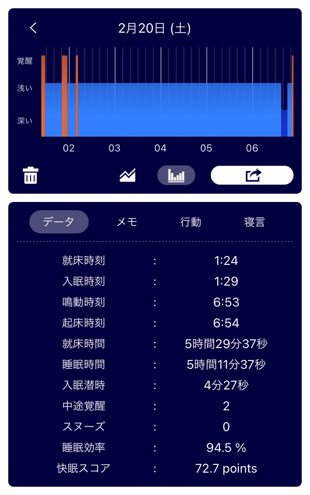
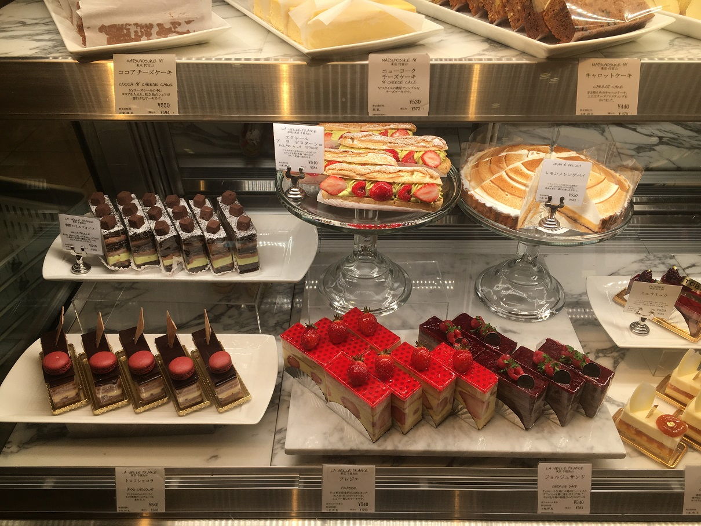

## 日課 (20th Feb 2021)

### 早起き

できなかった。  
アラーム 7:00 に止めたけど、起きたのは 10:30 くらい。  
深夜に寝るのが諸悪の根源。  
日付変わる前に寝る決意が夜が深まると揺らぐ。  

### 散歩

この日は散歩の代わりに駅に買い物に行ったよ。  
母の誕生日のご馳走の材料とケーキを買った。  
ケーキ屋の店員さんに「リュックで持ち帰ります」と言ったら、ケーキの形が崩れないように箱の底面に折った画用紙を貼り付けて固定してくれた。
やさしい店員さん、感謝。  
自分も外出している身だけど、駅前の人の多さには辟易しちゃうね。

_おいしそう_

### 歯磨き

夜は磨いたが、朝は磨かなかった。  
フロスしても出血しないのが普通になってきたから、出血した時だけ記すことにします。

### English

やらなかった。

## 日課 (21st Feb 2021)

### 早起き

できなかった。  
アラームすらかけなかったから質が悪い。  
実はこの前日は徹夜してたんすよ。6:30 ぐらいに寝た。

### 散歩

行ってない。外出しない日だった。  
ラジオ体操もしてないし、これからやる気力も起きない。  
やはり、朝にやるべきタスクを全部こなしてしまいたい。  
夜は休む時間だよ。

### 歯磨き

昨日はみがきしなかったから、朝磨いた。
すみません今日だけです。許して。

### English

これからやる。
