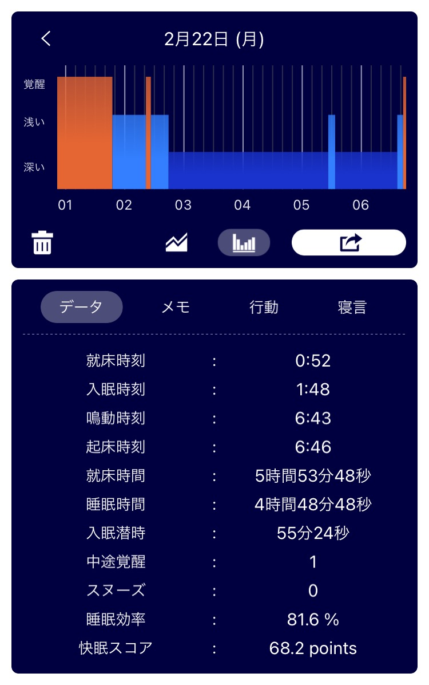

## 日課

### 早起き

ちょっとできた。  
アラーム 6:30 に止めたけど、8:30 ぐらいに布団から出た。  
PC の電源切ったらスマホいじらずに就寝態勢に入りたいよね。

### 散歩

行ってきた。  
9:10 から 9:20 まで。  
かなり暖かくなった。春の訪れを覚える。  
「今日はは暖かいですね」と近所の人に話しかけられた。  
「そうですね、ニュースでも季節を先取りとか言ってましたもんね」と応えた。

_いつもありがとう_

### 歯磨き

昨夜も今朝も、洗面所に何も持ち込まず、専念できた。

### English

[Virtual Babysitting Services in Demand for Working Parents in UK | Daily News Article](https://www.rarejob.com/dna/2021/02/22/virtual-babysitting-services-in-demand-for-working-parents-in-uk/)

#### My summary

Many parents in the UK have resorted to virtual nanny service in the country. The service is designed to help parents focus on work while someone watching over their children through video call.  
The feedback of the service is varied from parents. Some said that it got easy for her to leave children alone with the nanny over time. Other said that it isn't suitable for everyone and virtual interaction might not be replaced with face-to-face interaction.

#### New words

- **nanny (noun)** : a person tho is paid to take care of someone's child or children  
  Susan decided to go back to work, so she hired a nanny to watch her baby during the day.
- **buy into (phrasal)** : to agree with or support an idea or plan.  
  I don't buy into the idea that you need to go to college to be successful.
- **inquire (verb)** : to ask for information  
  I've already inquied about the hotel's group rates, but I haven't received any reply yet.
