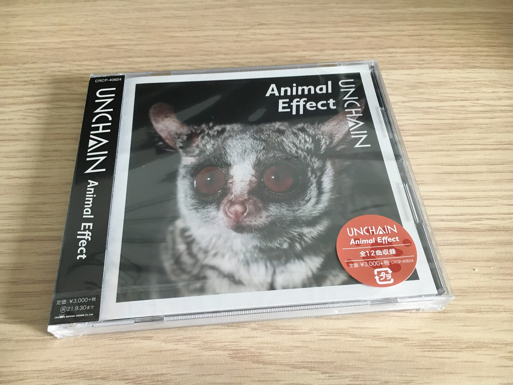

## 宣伝
2021 年春にリリースされた UNCHAIN のニューアルバム、『Animal Effect』はみんなはもう買ったかな？僕は買いました。  
まだ購入していない御仁はアコースティックライブのシリアルコードがもらえるタワーレコードで買うことをおすすめします。

_証拠写真_

## 感想

「Wait For The Sun」と「Dark House」が気に入りました。残りの曲も聞いていくうちに好きになるんじゃないかな。  
概して、人が耳にした回数が多ければ多いほどその曲が名曲に思えてくるからね。いつもアルバムで飛ばしてた曲が、ライブで披露されて一気に気に入っちゃうパターンもある。

とはいえ似たような曲調が多くてバラエティに乏しい気もする。前作の「FLASH」とか「Da, Da, Da, Da,」みたいなアップテンポな曲も欲しかった。

「Distant Neighbor」はどこ...? てっきりアルバムに収録されてると思ってた。可逆圧縮音源で出たらすぐ買うので待ってるよ、と言ってからもう 2 年経つし、観念して買うしかないか。

## まとめ

佐藤さんが脱退してしまって、改めて残念です。  
新たな環境での活躍をお祈りしてます。

YouTube で活動してるらしいけど、あんまり見る気が起きないのはどうしてだろう。結局アーティストが好きなんじゃなくて、曲が好きなのかな。

## あとがき

この記事を書きながらアルバム流してた、「Elephant Ship」もいい曲だと気づいた。  
好きだ！UNCHAIN！
