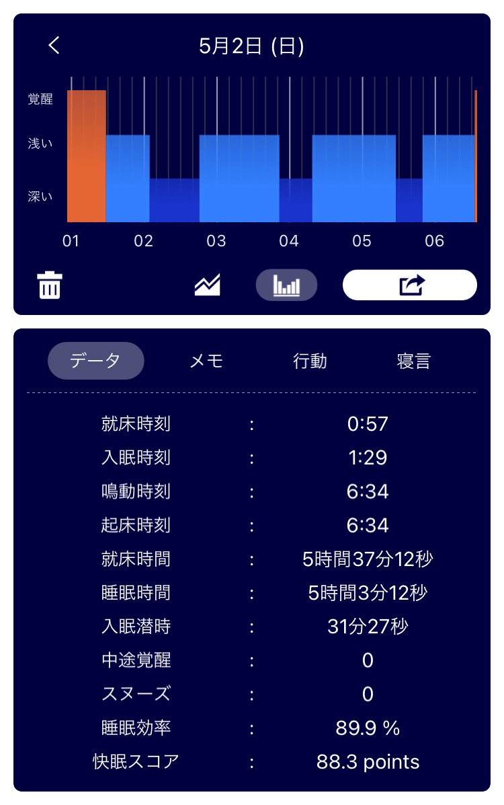
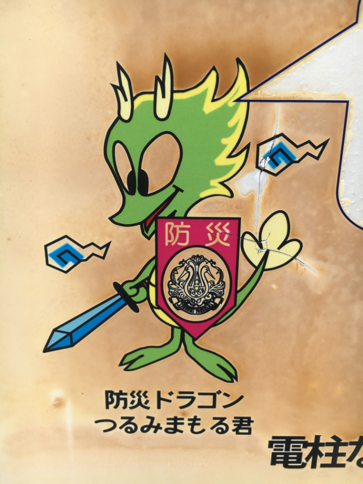

## 日課

### 早起き

案外寝るまで長いね。

### 散歩

行ってきた。  
11:00~11:40 まで。日も強くないし風も穏やかでお散歩日和だった。  

_縄張り狭いね_

### 歯磨き
磨いた。フロスはしてない。  

### English

[Interview: Mason becomes binding agent between Japan, UK Part 2 | Daily News Article](https://www.rarejob.com/dna/2021/05/02/interview-mason-becomes-binding-agent-between-japan-uk-part-2)

#### My summary

Kamiya holds all but the highest qualification in dry stone walling. He teached the required skills and knowledge in Japanese. It means Japanese craftsmen can bypass learning in the U.K. before the exam.  
Being able to communicate in English allows him to expand his professional and social network as well as to encounter new things, he says.

#### Discussions

**Thanks to Kamiya, Japanese craftspeople are able to bypass learning in the UK before the examination. In your opinion, is this a good or bad thing? Why? Discuss.**  
It's a good thing. Japanese craftsmen don't want to learn English skills but stone walling skills. Owing to him, they can learn skills that they just want to study.  
The disadvantage is that all Japanese craftspeople are too obsessed with Kamiya.

**Kamiya visits the UK annually to continue upskilling. Do you think it’s important to always continue learning, or is it okay to relax once you achieve a certain level? Why? Discuss.**  
It's important to continue learning. Firstly, if we stop learning, we will be bad at something. Secondly, the requied skills and knowledge are changing every time in some fields, such as Internet security. They should keep on learning to catch up with them.  

#### New words

- **bypass (verb)** : to avoid or ignore someone or something, often in order to achieve something more quickly  
  Jack bypassed the usual communication flow and spoke directly to the CEO because he needed an immediate answer.  

## 日記
高校の友達とオンライン飲み会をした。  
zoomだとどこか盛り上がりに欠けるように感じた。  
熱気が伝わってこないのかな。  

