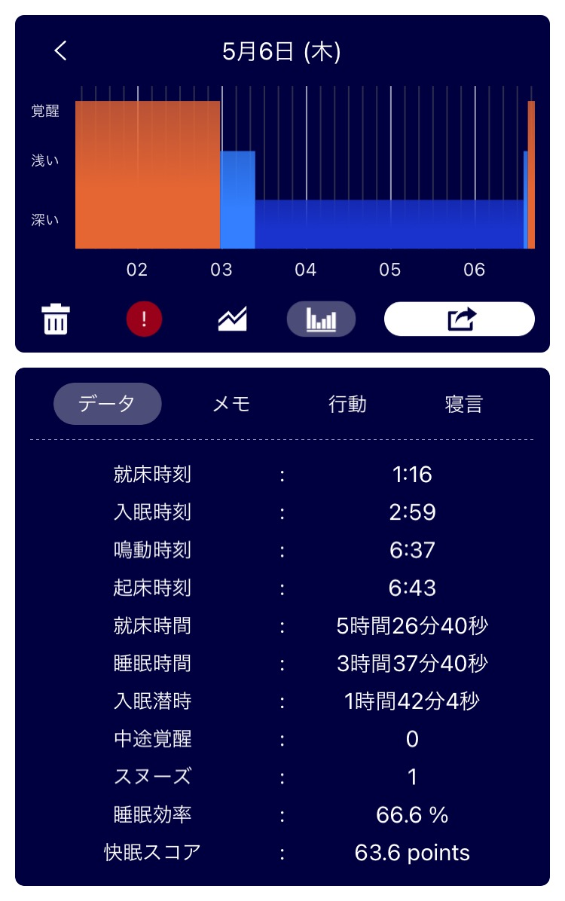

## 日課

### 早起き

深夜1時に寝るのがダメだし、寝るのに2時間近くかけてるのがダメダメすぎる。  
最近、暑くて寝苦しいとはいえここまで起きているのがデータとして残ってるのは面白いし、恥ずかしい。  

### 散歩

行ってない。そういう日もある。  

### 歯磨き
朝と夜磨いた。フロスはしてない。  

### English

[Man apologizes after failing to secure truck that caused deadly Taiwan railway crash | Daily News Article](https://www.rarejob.com/dna/2021/05/06/man-apologizes-after-failing-to-secure-truck-that-caused-deadly-taiwan-railway-crash)

#### My summary

The passenger train was hit by the truck which slid down onto the tracks. It derailed before entering the tunnel and crushed many passengers.  
The owner of the truck apologized in tears while being led away from his home by police.  
The accident happened on the public holiday, when families visit their hometowns to pay respect to their ancestors at their gravesites.  

#### Discussions

**In your opinion, is there any way for the truck owner to truly express how much remorse he feels? Why or why not? Discuss.**  
No, there isn't. What he can do is regretting what he did.

#### New words

- **slide (verb)** :  to move smoothly over a surface while continuing to touch it  
  slid (past tense and past participle)  
  Jane slid across the ice.  

- **remorse (noun)** :  a feeling of regret or guilt iver doing something bad or wrong  
  Dan was filled with remorse after he shouted angrily at his kids.

## crush, crash, clashの使い分け

### crush
**to press something so hard that it breaks or is damaged**  
壊れたり傷ついたりするぐらい、強い圧力をかけて潰す  
e.g.  His leg was crushed in the accident.  

### crash
1. **to hit something or someone extremely hard while moving, in a way that causes a lot of damage or makes a lot of noise**  
  動いてる間に何かに強くぶつけて、大きな傷や騒音をたてる  
  e.g.  A brick crashed through the window.  
2. **to have an accident in a car, plane etc by violently hitting somehitng else**  
  何かに強くぶつかることによって、車や飛行機が事故を起こす  
  e.g.  The jet crashed after take-off.  

### clash
1. **if two armies, group etc clash, they start fighting**  
  もし軍隊や集団がclashするなら、戦争が始まる  
  Troops clashed near the border.
2. **if two people or groups clash, they argue because they have different beliefs and opinions**  
  もし人や集団がclashするなら、異なる考え方や信念をもった人たちが議論する  
  e.g.  Democrats clashed with Republicans in a heated debate.  
3. **if two colors or designs clash, they look very bad together**  
  もし色やデザインがclashするなら、組み合わせが悪く見える  
  e.g.  I can't wear red --- it clashes with my hair.

参考：[オンライン版ロングマン現代英英辞典](https://www.ldoceonline.com/jp/)

## 日記
親戚のApple Musicのファミリープランに便乗させてもらった。  
Amazon Music Unlimintedと比較すると、メリットはAlexaの複数端末同時再生ができる点、デメリットはアプリからAlexaに曲をキャストできない点が挙げられる。  
AndroidでもApple Musicが使えるとは思わなんだ。  