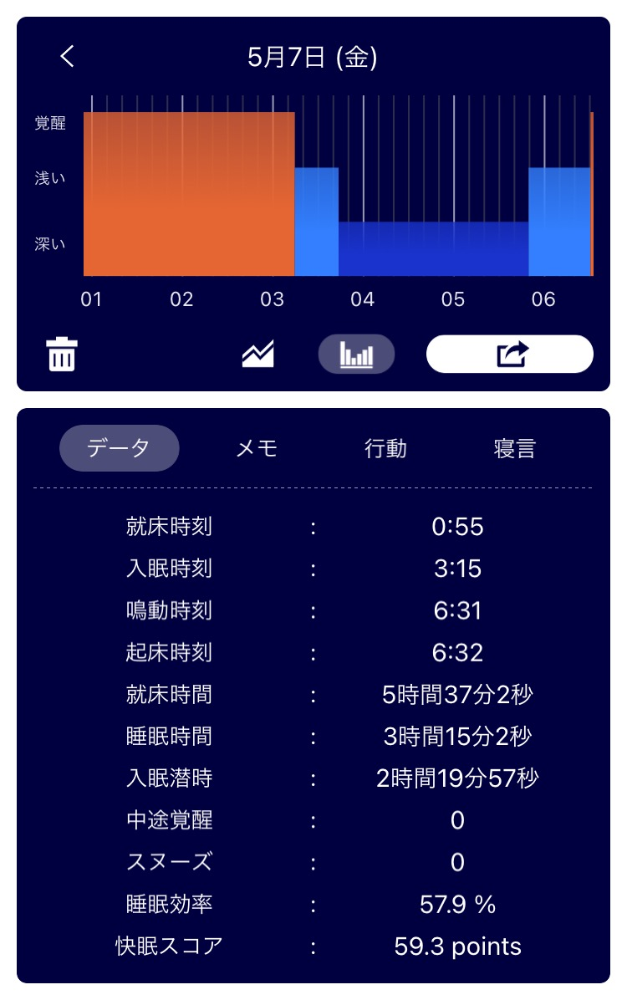
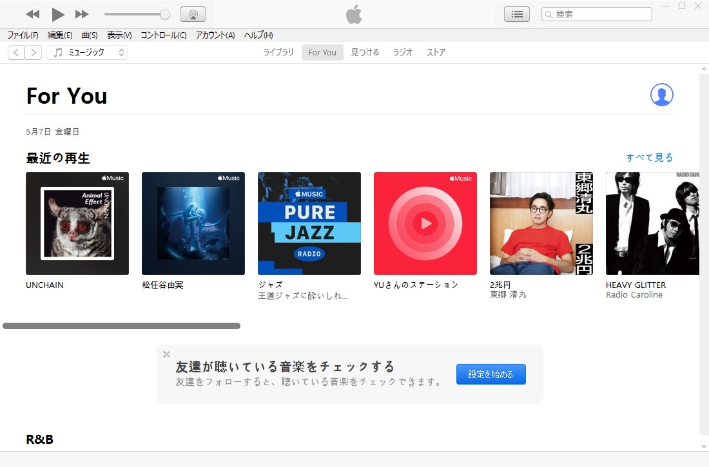

## 日課

### 早起き

睡眠時間が短すぎる.....！！！！  

### 散歩

雨降ってたけど行ってきた。  

  
_君が笑顔だと、僕も笑顔になれる_

### 歯磨き
朝磨いてないや。すまん。  
フロスしました。

### English

[Man apologizes after failing to secure truck that caused deadly Taiwan railway crash | Daily News Article](https://www.rarejob.com/dna/2021/05/07/news-mash-up-social-media/)

#### My summary

Twitter Inc. add a function that would give users a short time to withdraw a tweet before it is posted. An app researcher found this feature by looking at the code of the sites.  
Details from more than 500 million Facebook users have been found available on a website. The information appears to be several years old.  

#### Discussions

**Twitter is testing an “undo send” feature. Would you be interested in such a feature? Why or why not? Discuss.**  
No I wouldn't. Even if I were a twitter user, i wouldn't be interested in the feature. Because we can still delete our tweet after it is posted. New feature barely changed from this feature.

**A Twitter spokesperson said that Twitter would be testing possible paid-for features. Do you think most people would be willing to pay for extra features on social media? Why or why not? Discuss.**  
Yes I think so. Many people are addicted to social media. They are likely to be paid member to get removing advertisement feature.  

**Wong searches for unannounced social media features by looking at the sites’ code. Do you think it’s okay for her to announce what she finds to everyone? Why or why not? Discuss.**  
No I don't think so. What she did was the same as hacking. If she finds vulnerbility in the site, she should keep it to herself and let the company know secretly.  

#### New words

- **iterate  (verb)** :  to develop a product by repeatedly working on it and improving its previous versions  
  Developers iterate the app every month to fix bugs and add more features.  

## 日記
WindowsでApple MusicはiTunesでアクセスして使うんだけど、iTunesの日本語フォントが汚い。cssを直接書き換える方法をネットで見つけたけど、ストア版だとソフトウェアのファイルを編集できなくなるから、変更できない。  

  
_文字のカーニングがアレだよね_

中華DAPみたいなフォント。しんにょうの点が2個になるのは「謎」の「迷」の部分だけで十分。