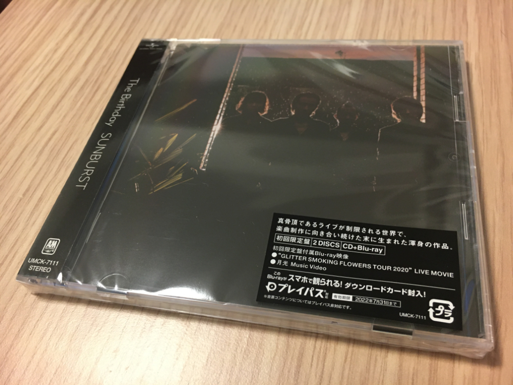

## 宣伝
2021 年夏にリリースされた The Birthday のニューアルバム、『SUNBURST』はみんなはもう買ったかな？僕は買いました。  
まだ買っていない人は, 初回限定版に「春雷」が入ったライブBlu-rayが入っているので, 買うべき.  

_証拠写真_

## 感想

### SUNBURST
一聴して気に入った曲は, 「月光」と「レボルバー」.

「月光」はYoutubeでPV見たときから気に入っていた.  
昔の曲でたとえれば, 「24時」とか「Buddy」みたいな, 歌ってるというよりメロディに合わせて語りかけてくるような曲は大好物です.  

一方「レボルバー」はメロディアスな曲で好き.  
ﾚｰﾎﾞｰﾊﾞｰﾌﾞﾙｰｽﾞｰｵ-ってついつい口ずさんでしまう.  

他の曲は今のところ...そんなに刺さってない...正直.  
これは別にこのアルバムが微妙ってわけじゃなくて, 僕の新譜あるあるです.  
『NOMAD』聞いたときも「GHOST MONKEY」以外微妙だなって思ってたのに, 何回も聞いてライブに参加してからは, 全曲好きになってた.  

『SUNBUST』もこれからガンガン聞いて, どんどん好きになっていこうかなと思います.  

### GLITTER SMOKING FLOWERS TOUR LIVE MOVIE
年々, アルバム付属のBlu-rayが豪華になっていってる.  
COME TOGETHERのときはセルフライナーノーツだけだったのに...成長したね.  
「24時」とか「Red Eye」みたいなチバがギター弾かない曲は, ライブ中のチバのくねくねした動きが見れて好き.  
もちろん他の曲も良かった.  
「BITCH LOVELY」に関してはこんな曲あったっけと思ってエアプ晒した.  

## まとめ
曲紹介して, 最後にspotifyとかApple Musicのリンク貼るやつ, 僕もやりたいです.  