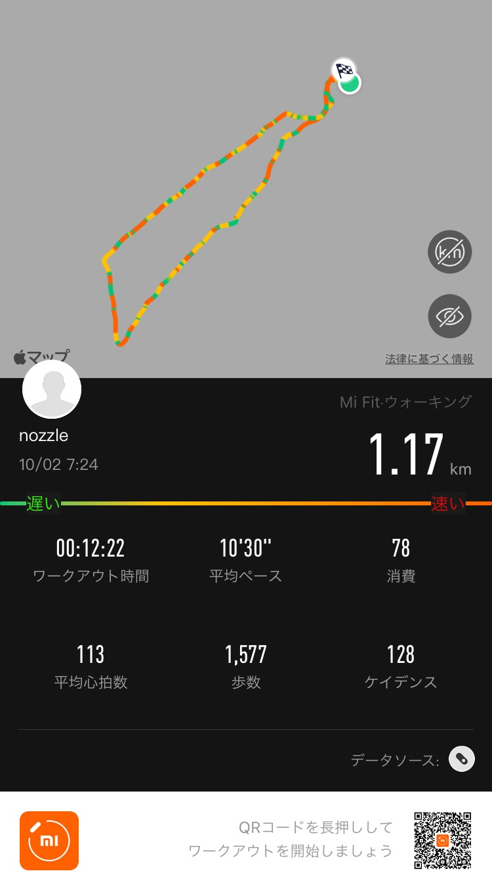

## 散歩
  
朝散歩再開しました。続けたいです。  
最近xiaomiのmi band 6を買って、歩いた記録がこうして残るのでモチベになります。  

## 日記
昨日が台風だったのもあって、今朝から昼まではいいお天気だった。  
19時あたりからはもうどしゃ降りで雷もゴロゴロなってて怖い思いをした。  
こういう大雨の時は駅の改札の外に大勢の人がいる。傘を持っていない人、持っているけど雨の勢いが落ち着くのを待っている人、傘を持っていない人を迎えに来た人、どのタイプの人が一番多いのかな。  

## 英語

[Business Spotlight: Japan Airlines Part 1 | Daily News Article](https://www.rarejob.com/dna/2021/10/02/business-spotlight-japan-airlines-part-1)

### 単語
* take over (idiom) : 引き継ぐ  
  e.g. The government took over the business in 1953.  

### Summary
Japan Airlines is the major international carrier in Japan.  
Thought it was originally a private company, the government took over the business two years after its establighment.  
After other companies were allowed to provide international flights and the tragic Flight 123 crash happened, the company privatized again in 1987.  

