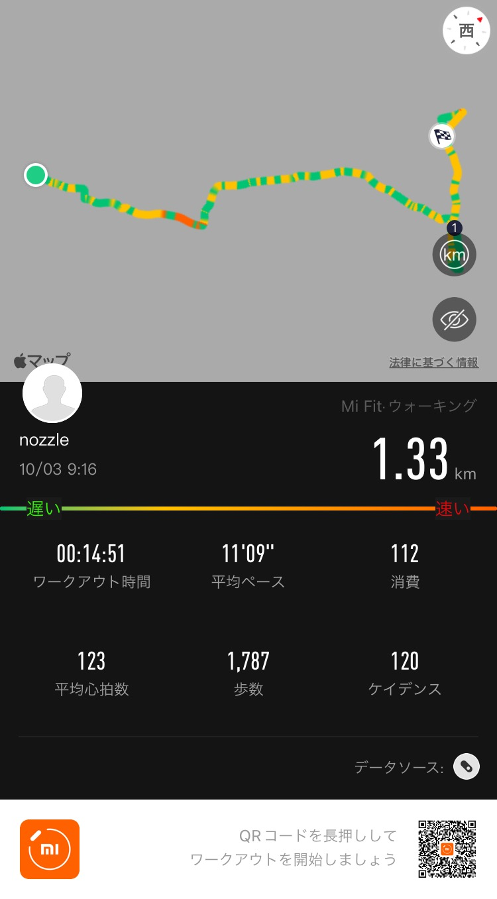
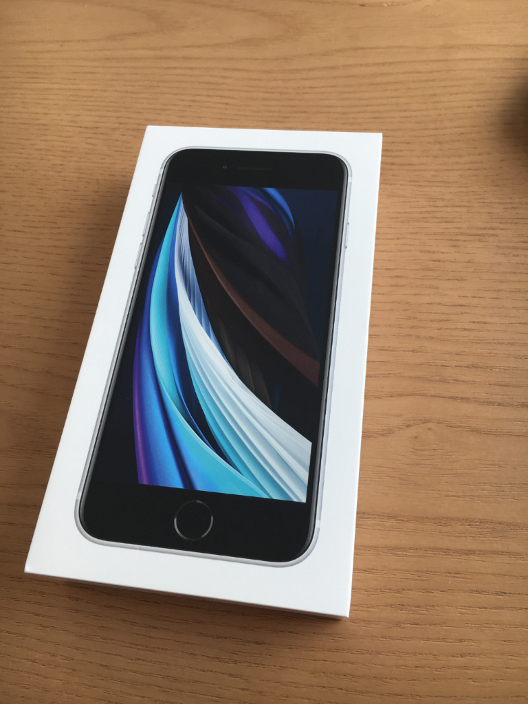

## 散歩

速度によって色が変わるようになってる。オレンジの部分は走った地点で、実際に走った記憶があるから見返しても面白い。  

## 日記

iPhone SEを買った。  
後日いろいろ言う。  

## 英語
[Business Spotlight: Japan Airlines Part 2 | Daily News Article](https://www.rarejob.com/dna/2021/10/03/business-spotlight-japan-airlines-part-2/)

### 単語
* subsidiary (noun) : 子会社
  e.g. subsidiary companies  

* file (verb) : 申し立てる, 提出する
  e.g. He filed a complaint for the restaurant's poor customer service.  

### Summary
Japan Airline had financial crisis and losses so that it filed for bunkruptcy in 2010.  
By 2012, Japan Airlines was in a better financial state and was able to relist on the Tokyo Stock Exchange.  
However it has reported a loss in profits because of the pandemic.  
