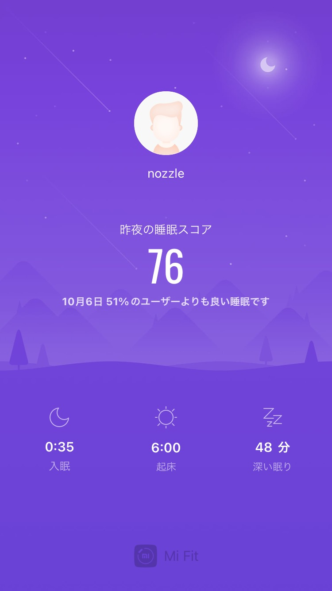
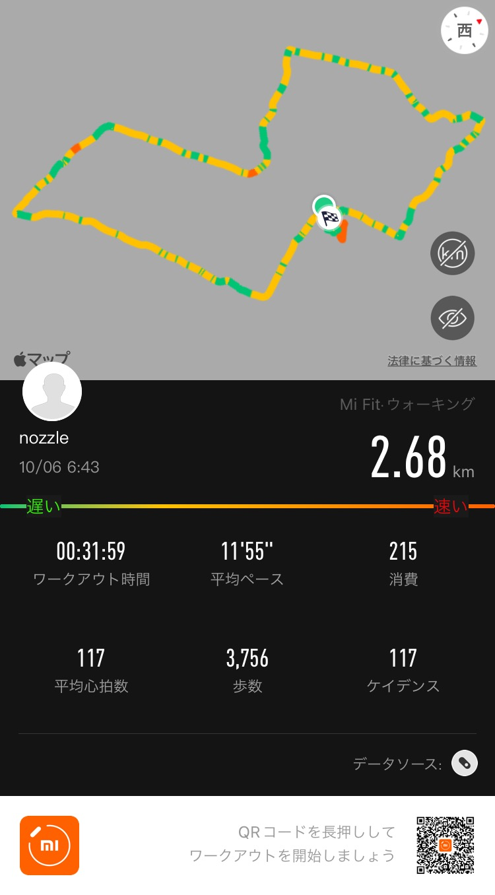

## 早起き

## 散歩

## 日記
6時に起きると朝めちゃめちゃ時間ある。  
iPhone に Suica入れたの忘れて、改札に拒否られた。

## 英語
[Daily News Article]()
### 単語
* front-line worker (noun) : an employee who directly interacts with people to provide important products or services as food or healthcare  
  e.g. Some stores now offer discounts for front-line workers to say thank you for their hard work.
* rollout (noun) : the introduction of a new product or service
  e.g. The rollout of out new beauty product line is scheduled for next month.
* dearth (noun) : a state of not having enough of something that people want or need
  e.g. The lack of rain this year is causing a dearth of water in the region.
* blood clot (noun) : a thick mass of dried blood that may stop the flow of blood to other parts of the body
  e.g. The doctors are afraid that the blood clot in her leg may move to her lungs.
