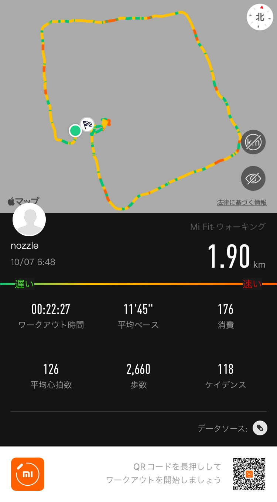
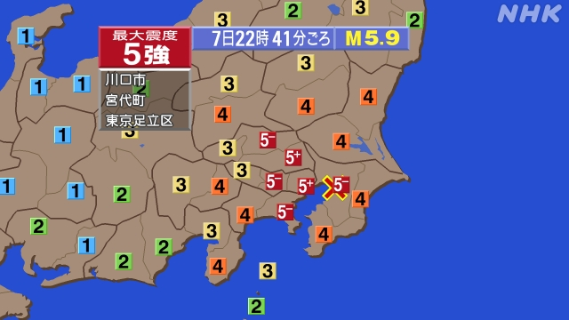

## 早起き

_この日7時間寝てるの、偉いよね_  
## 散歩

## 日記
昨夜、地震があった。
>
>引用：[【NHK】地震情報 | 震度など市区町村ごとの情報](https://www3.nhk.or.jp/sokuho/jishin/data/JS00cwA0211007224134_20211008084211.jpg)

群馬県は震度4だった。  
扇風機が倒れたり、食器棚の扉が開いたりしていたが、被害はなかった。  
**実は、昨日はあらゆることを放棄して寝てしまおう思い、** 22時には布団に入っていた。緊急地震速報と揺れに目覚めさせられた。未だにあの音は聞くと心臓バクバクになるから効果的だ。  
今朝起きてお湯を沸かそうとしたら、ガスの安全装置が働いていて、使えなくなっていた。もちろん、かんたんに復帰できた。こういうギミックが知らず知らず導入されていることにありがたみを覚える。  

今朝はそういうトラブルがあって、散歩できなかった。  
戒めに自宅でできるエクササイズ動画を見て試してみると、汗でビショビショになってしまった。お風呂に入り直したものの、こういうエクササイズはやるなら夕方にやらんとあかんと思った。  

## 英語
[China: Death toll triples to more than 300 from flooding in Henan province | Daily News Article](https://www.rarejob.com/dna/2021/10/08/china-death-toll-triples-to-more-than-300-from-flooding-in-henan-province/)
### 単語
* inundate (verb) : to cover an area with water 
  e.g. if The river doesn't stop rising soon, it's going to inundate the city.