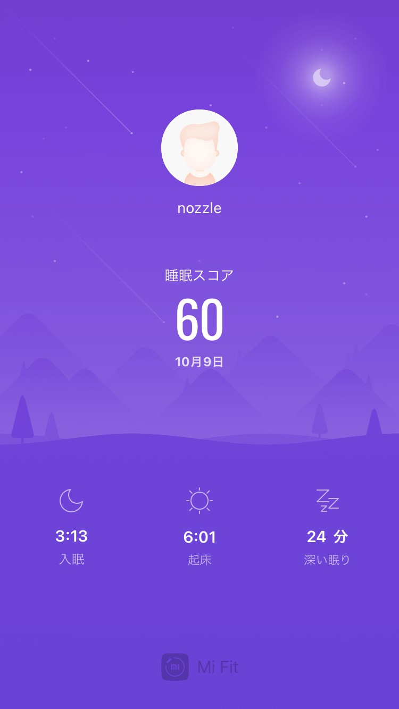
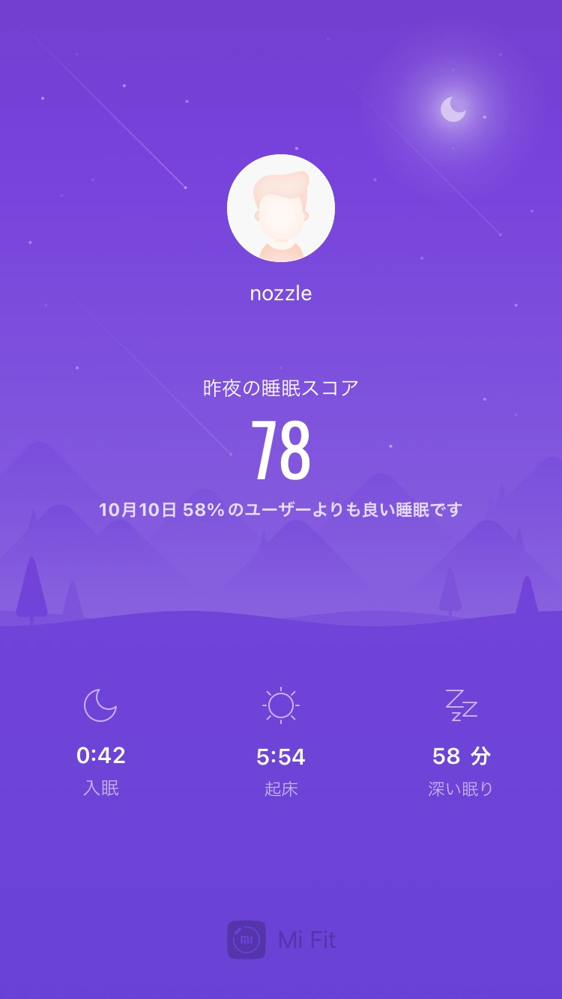
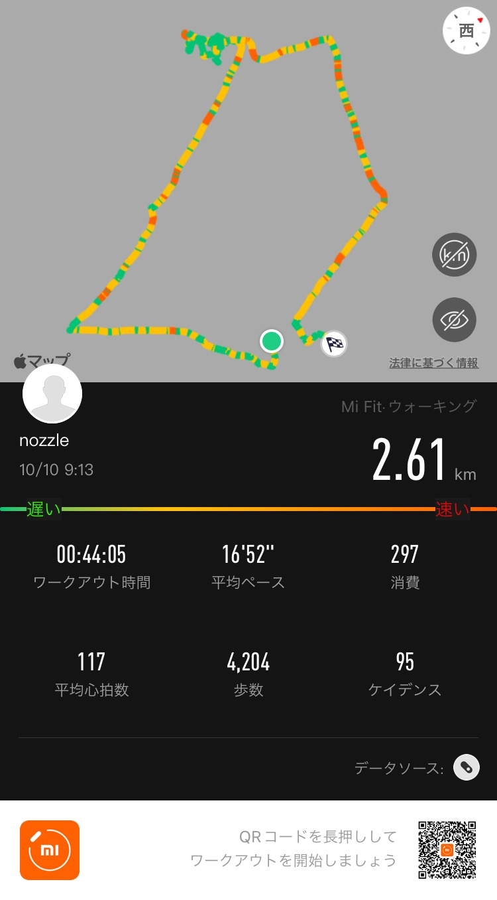

## 早起き

_2時間くらい昼寝したのが駄目だった..._

_0時には寝たけど、入眠は遅かった_

## 散歩

## 日記
### 10/09
iPhone SEに替えたので、おばあちゃんに今まで使っていたiPhone6Sを譲ることにした。引き継ぎとかの設定もあるから、直接渡しに行きました。  
お寿司のおもてなしがあった。

_おいしい_

iPhone5Sからの引き継ぎはスムーズにはいかなかった。5Sがbluetoothによる転送に対応していないせいで、PCのiTunesから移行せざるを得なかった。おじいちゃんのパソコンは動作がおもたくて読み込みも遅くてバックアップを取るだけでも一苦労だった。おじいちゃんは生前PCが重たいから替えたいと言っていたのに、その願いを叶えてあげられなかったことに申し訳ない気持ちがある。  

### 10/10
少し歩いたところにあるスーパー、9:00から開いてた。  

## 英語
[News Mash-up: Famous Singers | Daily News Article](https://www.rarejob.com/dna/2021/10/07/news-mash-up-famous-singers)
### 単語
* offer a glimpse into (idiom) : to give someone an idea of what something is like or a quick experience of how something works in order to help him/her understand it better
  e.g. The exhibit offered a glimpse into the earliest humans in the area.

* breach (noun) : a failure to follow a rule, law, or agreement
  e.g. David was fired because he committed a breach of the company's contract.

