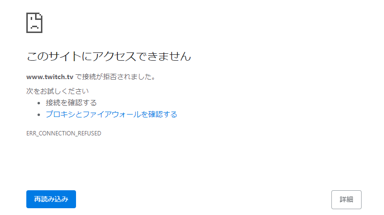

## 経緯

COVID-19 のために家から出てくれない人たちありがとう  
でもあなた方の中に、家だと集中力が 3 分と持たず youtube を開いてしまう人...いますよね

ドメイン設定を弄って解決させちゃいましょう！

## hosts ファイルを弄る

### Windows

windows 検索ボックス  
↓  
memo と入力  
↓  
メモ帳を右クリックして管理者として実行をクリック  
↓  
開くで"C:\Windows\System32\drivers\etc"に移動  
↓  
右下の"テキスト文書(.txt)"を"すべてのファイル(.\*)"に切り替える  
↓  
hosts が出るので選択

### Mac

```bash:title=zsh
sudo vim /private/etc/hosts
```

### 編集方法 (共通)

```shell:title=hosts(Windows)
# Copyright (c) 1993-2009 Microsoft Corp.
#
# This is a sample HOSTS file used by Microsoft TCP/IP for Windows.
#
# This file contains the mappings of IP addresses to host names. Each
# entry should be kept on an individual line. The IP address should
# be placed in the first column followed by the corresponding host name.
# The IP address and the host name should be separated by at least one
# space.
#
# Additionally, comments (such as these) may be inserted on individual
# lines or following the machine name denoted by a '#' symbol.
#
# For example:
#
#      102.54.94.97     rhino.acme.com          # source server
#       38.25.63.10     x.acme.com              # x client host

# localhost name resolution is handled within DNS itself.
#	127.0.0.1       localhost
#	::1             localhost
```

```bash:title=hosts(Mac)
##
# Host Database
#
# localhost is used to configure the loopback interface
# when the system is booting. Do not change this entry.
##
127.0.0.1       localhost
255.255.255.255 broadcasthost
::1             localhost

```

上みたいのが出たら

127.0.0.1 [ブロックしたいサイトのドメイン]
その下にブロックしたいサイトを書いていこう

```shell
127.0.0.1 youtube.com
```

うまくいかないときはホストがちょっと変わった連中もまとめて列挙しよう

```shell
# favorite sites
127.0.0.1 youtube.com
127.0.0.1 www.youtube.com
127.0.0.1 twitter.com
127.0.0.1 www.twitter.com
127.0.0.1 www.twitch.tv
127.0.0.1 www.nicovideo.jp
```

頭に#をつけるとコメントアウトできる

登録し終わったら保存して、ブラウザのキャッシュを消そう

## するとどうでしょう


アク禁されてる、やったね

## こんなんやってもスマホ開いちゃう人

forest やろう。iOS だと 250 円かかるけどかかるのが逆にいい！

## まとめ

結局ここまでやっても漫画とか読んじゃう

<font size=10 color="Red"><b>死</b></font>

(Reposted from nozzlog, Written on 2020-12-05)
