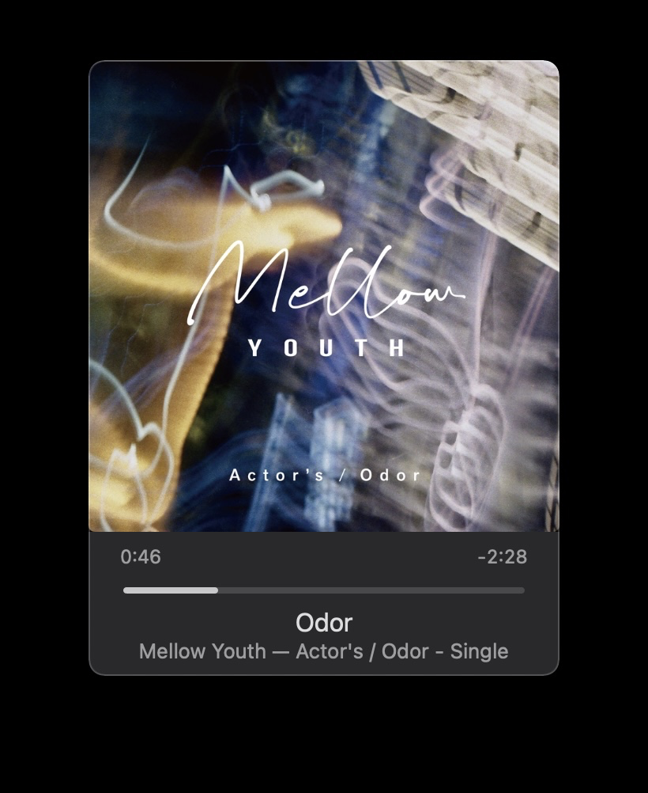

## Spotifyのダイマ  

Spotifyは、月額で音楽聴き放題になるサブスクリプションの一つです。  
この度、あまたの音楽サブスクを練り歩いた結果、Spotifyに居を構えてみることにしました。  
かなり気に入ったので、昨日の今日でプレミアムになったばかりだけど、比較レビューします。  
こういう音楽サブスク比較はスマホ版を使う人がほとんどで、Windowsユーザのレビューはなかなか貴重です。みんなもよく聞くように。  

### Amazon Music Unlimited
#### いいところ
* **Alexaとの連携ができる**
  

  スマホのAmazon Musicアプリを使えば、気に入った曲のプレイリストを作って、Alexa対応端末に流してもらうことができる。(Alexa Cast)  
  Apple MusicやSpotifyでも自作プレイリストを流すことはできるが、プレイリスト名を音声認識してもらわねばならない。指定のアレクサ端末に確実に音楽を再生させられるところは、Amazon Musicの利点だ。  

#### わるいところ
* **Echo端末に聞いた曲が表示される**  
  Alexa端末との連携があるせいで、Echo Showの画面に最近聞いた曲がランダムに表示されることがある。アニソン聞いたらすぐオタクとか、そういう息苦しい時代は終わったとは言え、やはりお茶の間で萌えキャラのジャケットが出ると、家族の冷たい目が気になってしまいます。  
  逆に、こういう曲聞いてますｗみたいのをステータスにしたい人は、この連携を活かして周りにアピールしたら良いと思います。  

### Apple Music
#### いいところ
* **ミニプレーヤーがある**
    
    ミニプレーヤー対応のソフトって案外多くないんですよね。  
    デスクトップの片隅にちょこんと置いておくには便利です。

* **ミュージックビデオが見れる**
    
    これもApple Musicならではの利点。全アーティストが全てのミュージックビデオを解禁しているわけではないので注意がいるが、一部でも視聴できる機能があるだけで差別化できててすごい。

#### わるいところ
* **Win版iTunesの出来が悪い**  

      
  WindowsではiTunesの中にApple Musicの機能が埋め込まれてて、使いづらい、というかダサい。  
    2010年代前半で時が止まってる感あります。ダークモードもないです。  
クリックしたときの、読み込みのもたつきとのせいで使い心地が非常によろしくない。ページ遷移するとき、一瞬画面が真っ白にフェードアウトしてからフェードインするのも目に毒。  

  
  ちなみに同じページのMac版はこんな感じです。これはカッコイイ。  

  そうそう、Win版iTunesのひどさを語るなら中華フォントにも触れておかねばなりませんね。  

  

  **なにこれ？**  
  「き」がギリシャ文字みたいになってますよ。  

  

  アルバムのページに遷移してもこのフォント。  
  ジャケットの「き」の方がバランスいいよ。  

### Spotify

#### いいところ
* **PCとスマホを連携して自由に再生できる**
    

  Spotify対応デバイス、またはSpotifyをダウンロードしたスマホやPCシームレスにがつながる。(Spotify Connect)  
  これを使うと、スマホで好きな曲を選んで、PCスピーカーで再生する、なんてことができる。早い話が、Spotifyを軸に家中の端末が再生端末とリモコンになるってこと。  

* **自分が所持している曲を読み込める**
  

  アイドルマスターシリーズはサブスク解禁していないが、音源をもっているなら「ローカルファイル」として、Spotifyに取り込むことができる。もちろん、サブスク曲とローカルファイルを織り交ぜた混合プレイリストも作れる。この機能のおかげで、所持音源も含めてPCの音楽再生を全てSpotifyに集約させられて便利である。

* **ローカルファイルもスマホでオフライン再生できる**
  

  スマホのオフライン再生機能はどのサブスクにもあるのだが、ローカルファイルまでスマホでダウンロードしてオフライン再生できる。まるでサブスクが解禁されているかのような錯覚を覚えるほど、自然に溶け込んでいるのがわかるだろう。

#### わるいところ
* **歌詞をスクロールして再生地点を選べない**
  
  曲にあわせて、歌詞がスクロールされるのは他の音楽サブスクと同じなのだが、歌詞を選んでその地点から再生することがSpotifyはできない。  
  その上、PC版Spotifyは一時停止しながら歌詞を全て閲覧することができない。(Win, Mac共通)  

## 総評
Spotifyが、ソフトウェアとして最もよくできていた、スマホPCの壁を取っ払える仕組みや、わかりやすく操作しやすいUIで使っていてストレスがない。  
音楽のレコメンドとかはこれから評価していきたい。
