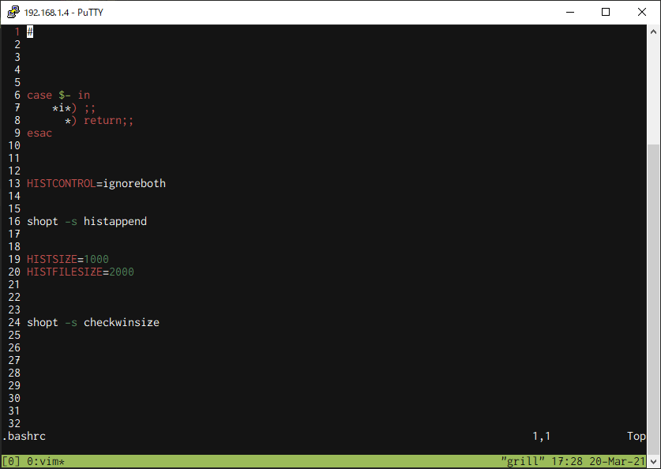
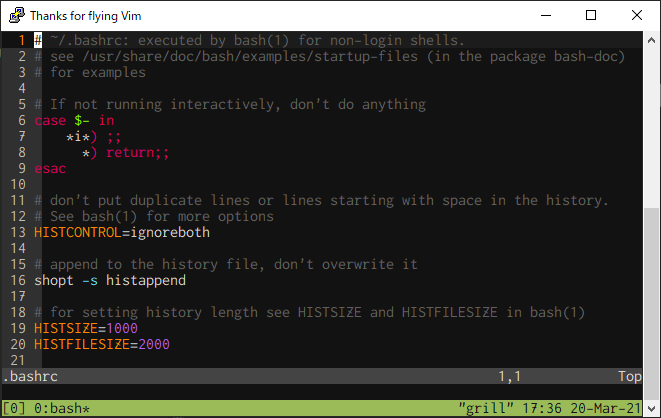

## 経緯

tmux で開いた vim の表示が明らかにおかしい


_おかしい_

## 解決法

.bashrc に以下を追記する

```bash:title=.bashrc
alias tmux="tmux -2"
```


_やったね_

## 解説

色がおかしいのは 256 色表示ができていないから  
`tmux -2`で tmux を強制 256 色表示にできる

## うまくいかなかった解決策

- .tmux.conf の編集
  - `set -g default-terminal "tmux-256color"` の追記
  - `set -g default-terminal "screen-256color"` の追記
  - `set-option -g default-terminal "xterm"` の追記
- .bashrc の編集
  - `export TERM=xterm-256color` の追記

## 検証したこと

表示がおかしいときに vim で以下のコマンドを行なった

```vim:vim
:echo &term     # screen
:echo &t_Co     # 256
```

ちゃんと 256 色表示になっているから色が vim で色が限定されているわけではなさそう？  
`.vimrc`を読み込んでないだけなら番号やカーソル表示もできなくなるべきだし、理由が分からない。

## まとめ

`tmux -2`と`set -g ......`が必ずしも等価でない可能性がある。  
それが分かれば解決しそうなんだけど...力不足でした。
