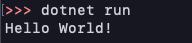

ximeaのカメラを動かすまで

### ximeaのソフトウェアインストール

https://www.ximea.com/support/documents/4


### MacでのC#開発環境構築

visual studio codeでできる。

1. .netのサイト(https://dotnet.microsoft.com/download)からsdkインストール
zshの場合パスが通らないことがあるのでパスを通す
```zsh
ln -s /usr/local/share/dotnet/dotnet /usr/local/bin
```

2. 新しいdotnetプロジェクトを作成する
```zsh
dotnet new console
```
以下のコマンドで実行できる
```
dotnet run
```


3. VSCodeにC#拡張機能インストール

### カメラのマウント取り付け


これが…

こう！！！


### ximeaのサンプルコードぱくる
(https://www.ximea.com/support/wiki/apis/xiAPINET)

### python バージョン確認
インストール済パッケージの一覧表示: pip list
インストール済パッケージの一覧表示: pip freeze
インストール済パッケージの個別詳細表示: pip show

### macでximeaを動かす
xiCamToolを開いて右上の再生ボタンを押す

### macでximeaを動かす
https://www.ximea.com/support/wiki/apis/XIMEA_macOS_Software_Package

```
sudo port install gstreamer010-gst-plugins-good gtk-engines2
```

zshを使っていて`port: command not found`と言われた場合は
https://www.macports.org/install.phpにいってインストール
その後パスを通す
```bash:title=./zshrc
export PATH="/opt/local/bin:$PATH"
```
パスを通せているか確認
```bash:title=zsh
echo $PATH
```

実行したら次のようなエラーが出た
```bash
Warning: The macOS 11.2 SDK does not appear to be installed. Ports may not build correctly.
Warning: You can install it as part of the Xcode Command Line Tools package by running `xcode-select --install'.
```
これについては[別の記事](https://narazuke.github.io/xcode-error)に書く


### ximeaをC#で動かす

### ximeaをpythonで動かす


https://www.ximea.com/support/wiki/apis/Python_inst_macos


### 参考
[Visual Studio CodeでC#プログラム開発環境構築【Mac】](https://qiita.com/jsj05543/items/e9f5b0e5b6b4ac0a892b)

[Macに.NetCoreをインストールしてもdotnetコマンドが使えない時は](http://stonebeach-dakar.hatenablog.com/entry/Macでdotnetコマンドが使えないときは)

[zshにMacPortsをインストール](https://teratail.com/questions/169183)
