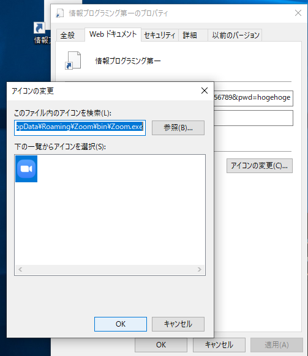

## 結論
### パラメータ
* **URL**: https://example.zoom.us/j/123456789?pwd=hogehoge  
* **ID**: 123456789  
* **password**: hogehoge  

### 方法

1. デスクトップ右クリック 
2. 新規作成 -> ショートカット
  

3. 入力欄に次のように入力 (IDとpasswordは変更してください)  
    `zoommtg://zoom.us/join?action=join&confno=123456789&pwd=hogehoge`  
  

4. 適当に名前をつける
  

5. 完成

---

#### アイコン直したい人  

6. 右クリック -> プロパティ  
  

7. アイコンの変更 -> 選択してOK
  

8. 完成

## 参考
[Shortcut to Zoom | zzzzBov](https://zzzzbov.com/blag/shortcut-to-zoom)

